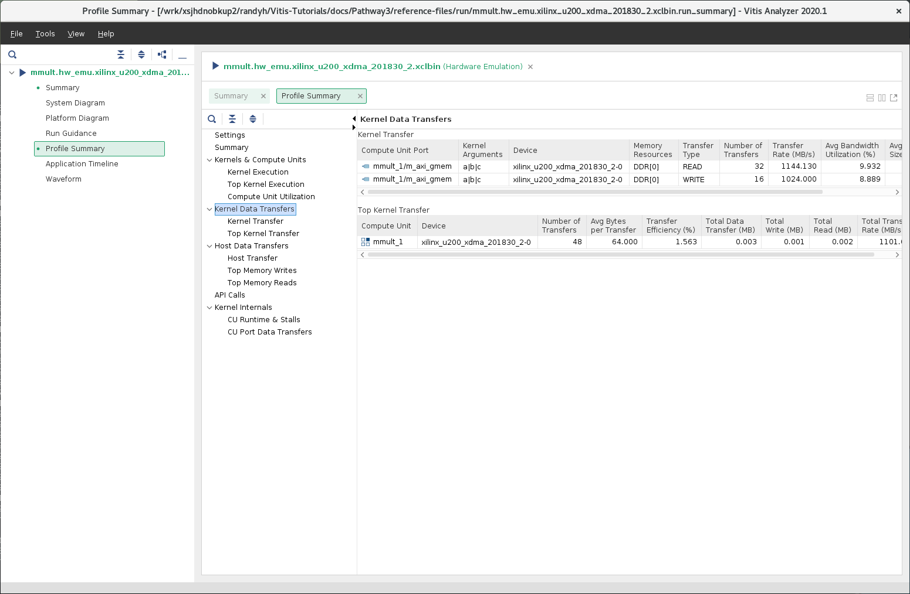
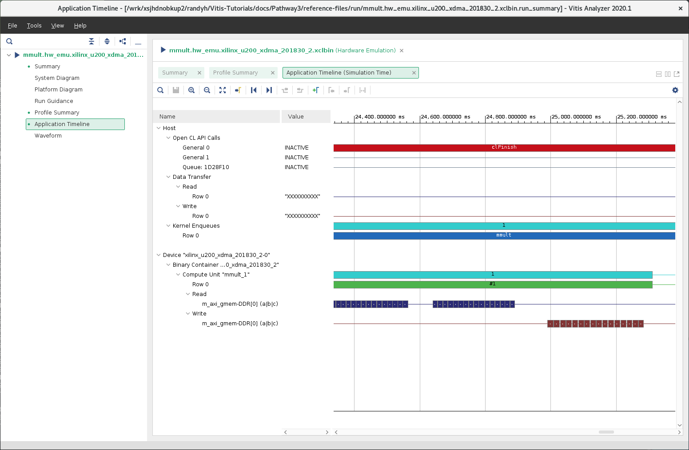

<table class="sphinxhide">
 <tr>
   <td align="center"><h1>2020.1 Vitis™ アプリケーション アクセラレーション開発フロー チュートリアル</h1><a href="https://github.com/Xilinx/Vitis-Tutorials/branches/all">2019.2 Vitis アプリケーション アクセラレーション開発フロー チュートリアル</a></td>
 </tr>
 <tr>
 <td>
 </td>
 </tr>
</table>

# 3\. プロファイルおよびトレース レポートの生成

## 概要

プロファイル サマリおよびアプリケーション タイムライン レポートを生成すると、デザインをより理解できます。

* プロファイル サマリには、全体的なアプリケーション パフォーマンスに関する注釈付きの詳細が表示されます。
* アプリケーション タイムラインは、ホストとデバイスのイベント情報を収集し、共通のタイムラインに表示します。これは、システムの全体的な状態とパフォーマンスを視覚的に表示して理解するのに役立ちます。

プロファイル サマリおよびタイムライン トレース レポートは、すべてのビルド ターゲット (`sw_emu`、`hw_emu`、および `hw`) で生成されます。ただし、レポートの精度はビルド ターゲットによって異なります。たとえば、`sw_emu` ビルドの場合、プロファイル サマリ レポートにカーネル実行効率およびデータ転送効率の下にデータ転送の詳細は含まれません。

この演習では、ハードウェア エミュレーションを使用してプロファイリングの手順を説明します。ここでの手順は、`sw_emu` または `hw` をターゲット (`-t sw_emu` または `-t hw`) にすると、ほかのフローでも使用できます。

> **重要:** ステム ビルドでデバイスのプロファイリングをオンにすると (`-t hw`)、全体的なアプリケーションのパフォーマンスに悪影響を与える可能性があります。この機能は、パフォーマンスのデバッグにのみ使用し、プロダクション ビルドではオフにするようにしてください。

## 開始前の確認事項

この演習を実行する前に、[アプリケーションのビルド](./BuildingAnApplication.md)演習および[ソフトウェアおよびハードウェア エミュレーションの実行](./Emulation.md)演習を実行しておく必要があります。

## エミュレーション データの生成

プロファイル サマリおよびアプリケーション タイムライン レポートは、デフォルトでは生成されません。これは、エミュレーション データを生成する時間が長くなり、ディスク スペースが多く必要となるからです。このため、エミュレーションを実行する前にプロファイリング データの収集を有効にしておく必要があります。これには、ホスト プログラムと同じディレクトリ、この場合は `./reference-files/run` ディレクトリにある `xrt.ini` テキスト ファイルでオプションを設定します。`xrt.ini` ファイルの詳細は、『Vitis 統合ソフトウェア プラットフォームの資料』 (UG1416) のアプリケーション アクセラレーション開発フローの [Vitis 環境リファレンス資料](https://japan.xilinx.com/cgi-bin/docs/rdoc?v=2020.1;t=vitis+doc;d=yxl1556143111967.html)を参照してください。

### xrt.ini ファイルの作成

まず、`xrt.ini` ファイルを作成して必要なオプションを追加します。`xrt.ini` ファイルはザイリンクス ランタイム (XRT) を設定し、ランタイムにイネーブルにすることが可能なデバッグ、エミュレーション、およびレポートのさまざまな機能をサポートします。これらの機能は必要に応じてイネーブル/ディスエーブルにでき、パフォーマンスを向上してアプリケーションのリソース使用量を削減します。

1. `./reference-files/run` ディレクトリに `xrt.ini` というファイルを作成します。

2. このファイルに次の行を入力します。

   ```
   [Debug]
   profile=true
   timeline_trace=true
   data_transfer_trace=fine
   ```

   > **コマンド オプションおよび説明**
   >
   > * `[Debug]`: デバッグ特有のコマンド
   > * `profile=true`: プロファイル モニタリングをイネーブルにします。
   > * `timeline_trace=true`: タイムライン トレース情報の収集をイネーブルにします。
   > * `data_transfer_trace=<value>`: デバイス レベルの AXI データ転送情報をイネーブルにします。
   >   * `fine`: すべての AXI レベルのバースト データ転送を表示します。
   >   * `coarse`: 計算ユニット (CU) の転送アクティビティを最初の転送の初めから最後の転送の終わり (計算ユニットの転送終了前) まで表示します。
   >   * `off`: 読み出しをオフにして、ランタイム中にデバイス レベルのトレースがレポートされないようにします。

3. ファイルを保存して閉じます。

### --profile\_kernel を指定してハードウェア エミュレーションをビルドおよび実行

`xrt.ini` ファイルでプロファイリングとタイムライン トレースをイネーブルにすると、エミュレーション中にパフォーマンス データが収集され、CSV ファイルに保存されます。ザイリンクス デバイスからパフォーマンス情報を収集するには、ハードウェア リンク段階で `--profile_kernel` オプションを使用してデバイス バイナリ (.xclbin) をビルドする必要もあります。`--profile_kernel` の詳細は、『Vitis 統合ソフトウェア プラットフォームの資料』 (UG1416) のアプリケーション アクセラレーション開発フローの [Vitis 環境リファレンス資料](https://japan.xilinx.com/cgi-bin/docs/rdoc?v=2020.1;t=vitis+doc;d=yxl1556143111967.html)を参照してください。

1. `design.cfg` ファイルを編集し、次に示すように `--profile_kernel` オプションを追加します。

   ```
   platform=xilinx_u200_xdma_201830_2
   debug=1
   save-temps=1
   profile_kernel=data:all:all:all

   [connectivity]
   nk=mmult:1:mmult_1
   ```

2. 次のコマンドを使用してカーネルをビルドし直します。

   ```bash
   v++ -t hw_emu --config design.cfg -c -k mmult -I'../src' -o mmult.hw_emu.xilinx_u200_xdma_201830_2.xo ../src/mmult.cpp
   v++ -t hw_emu --config design.cfg -l -o mmult.hw_emu.xilinx_u200_xdma_201830_2.xclbin mmult.hw_emu.xilinx_u200_xdma_201830_2.xo
   ```

   > **ヒント:** `--profile_kernel` オプションは、`v++` コマンド ラインでも指定できます。

   これにより、プロファイリングをサポートする新しい `.xclbin` ファイルが生成されます。デザインのビルドに関する詳細は、[アプリケーションのビルド](./BuildingAnApplication.md)演習を参照してください。

3. ビルドが終了したら、次のコマンドを使用してエミュレーションを実行します。

   ```bash
   emconfigutil --platform xilinx_u200_xdma_201830_2
   export XCL_EMULATION_MODE=hw_emu
   ./host mmult.hw_emu.xilinx_u200_xdma_201830_2.xclbin
   ```

### 実行サマリの表示

エミュレーションを実行すると、実行ディレクトリに次のファイルが生成されます。

* `run_summary` (Vitis アナライザーの実行サマリ)
* `profile_summary.csv` (プロファイル レポート)
* `timeline_trace.csv` (タイムライン トレース)

Vitis アナライザーを使用すると、`run_summary` ファイルを読み込むことができ、プロファイル サマリおよびタイムライン トレースも読み込むことができます。Vitis アナライザーの詳細は、『Vitis 統合ソフトウェア プラットフォームの資料』 (UG1416) のアプリケーション アクセラレーション開発フローの [Vitis アナライザーの使用](https://japan.xilinx.com/cgi-bin/docs/rdoc?v=2020.1;t=vitis+doc;d=jfn1567005096685.html)を参照してください。

> **重要:** ハードウェア エミュレーションで run\_summary を生成するには、前述のように、`xrt.ini` に `profile=true` および `timeline_trace=true` が含まれている必要があります。

1. 次のコマンドを実行して `run_summary` を開きます。

   ```bash
   vitis_analyzer mmult.hw_emu.xilinx_u200_xdma_201830_2.xclbin.run_summary
   ```

2. 次の図に示すように \[Profile Summary] を選択します。カーネル実行時間、ホストからグローバル メモリへのデータ転送、カーネルからグローバル メモリへのデータ転送に関連する情報が表示されます。

   

3. \[Application Timeline] を選択します。カーネル実行、ホストからのデータ読み出しおよび書き込み、OpenCL API 呼び出しなどのイベントに関する情報が表示されます。

   

   プロファイル サマリおよびタイムライン トレース レポートの詳細は、『Vitis 統合ソフトウェア プラットフォームの資料』 (UG1416) のアプリケーション アクセラレーション開発フローの[アプリケーションのプロファイル、最適化、およびデバッグ](https://japan.xilinx.com/cgi-bin/docs/rdoc?v=2020.1;t=vitis+doc;d=wzc1553475252001.html)を参照してください。

## 手順のサマリ

プロファイル サマリとタイムライン トレース レポートを生成して表示するのに必要な手順をまとめると、次のようになります。

1. `xrt.ini` ファイルを作成します。

   ```bash
   [Debug]
   profile=true
   timeline_trace=true
   data_transfer_trace=fine
   ```

2. `design.cfg` ファイルに `--profile_kernel` オプションを追加します。

   ```
   platform=xilinx_u200_xdma_201830_2
   debug=1
   save-temps=1
   profile_kernel=data:all:all:all

   [connectivity]
   nk=mmult:1:mmult_1
   ```

3. `--profile_kernel` オプションでプラットフォームをビルドします。

   ```bash
   v++ -t hw_emu --config design.cfg -c -k mmult -I'../src' -o mmult.hw_emu.xilinx_u200_xdma_201830_2.xo ../src/mmult.cpp
   v++ -t hw_emu --config design.cfg -l  -o mmult.hw_emu.xilinx_u200_xdma_201830_2.xclbin mmult.hw_emu.xilinx_u200_xdma_201830_2.xo
   ```

4. アプリケーションを実行します。

   ```bash
   emconfigutil --platform xilinx_u200_xdma_201830_2
   export XCL_EMULATION_MODE=hw_emu
   ./host mmult.hw_emu.xilinx_u200_xdma_201830_2.xclbin
   ```

5. 実行サマリと関連のレポートを表示します。

   ```bash
   vitis_analyzer mmult.hw_emu.xilinx_u200_xdma_201830_2.xclbin.run_summary
   ```

# 次の手順

エミュレーションを実行して機能が正しいこととパフォーマンスを確認したら、実際のデバイスでアプリケーションを実行します。[ハードウェアでの実行](./HardwareExec.md)演習では、ハードウェアでアプリケーションを実行する方法を説明します。</br>

<hr/>
<p align="center" class="sphinxhide"><b><a href="../vitis-getting-started/README.md">入門コースの初めに戻る</a> &mdash; <a href="/docs/Pathway3/README.md">チュートリアルの初めに戻る</a></b></p>
<p align="center" class="sphinxhide"><sup>Copyright&copy; 2020 Xilinx</sup></p>
