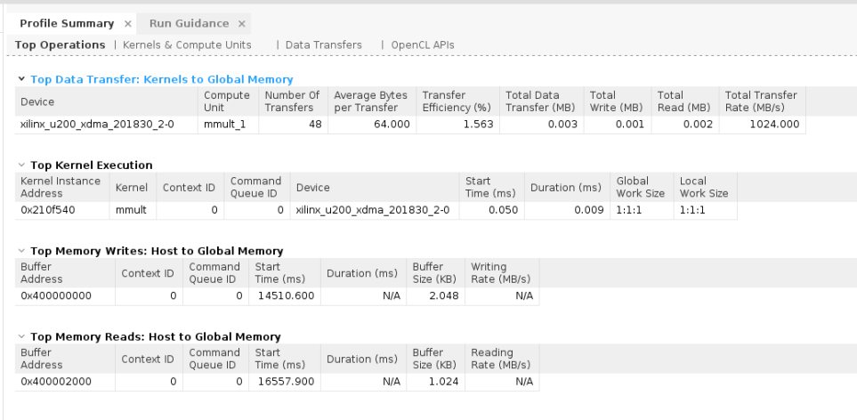
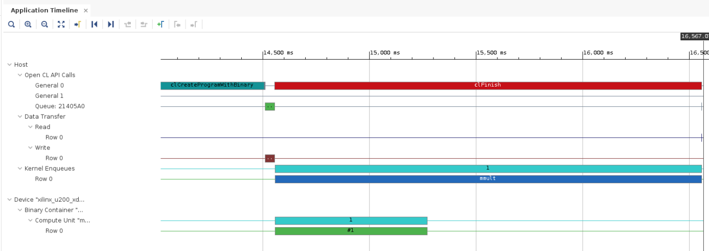

<table>
 <tr>
   <td align="center"><h1>2019.2 Vitis™ アプリケーション アクセラレーション開発フローのチュートリアル</h1><a href="https://github.com/Xilinx/SDAccel-Tutorials/branches/all">SDAccel™ 開発環境 2019.1 チュートリアルを参照</a></td>
 </tr>
 <tr>
 <td align="center"><h1>アクセラレーション アプリケーションのビルドおよび実行の基本概念</h1>
 </td>
 </tr>
</table>

# 3\. プロファイルおよびトレース レポートの生成

## 概要

プロファイル サマリおよびアプリケーション タイムライン レポートを生成すると、デザインをより理解できます。

* プロファイル サマリには、全体的なアプリケーション パフォーマンスに関する注釈付きの詳細が表示されます。
* アプリケーション タイムラインは、ホストとデバイスのイベント情報を収集し、共通のタイムラインに表示します。これは、システムの全体的な状態とパフォーマンスを視覚的に表示して理解するのに役立ちます。

プロファイル サマリおよびタイムライン トレース レポートは、すべてのビルド ターゲット (`sw_emu`、`hw_emu`、および `hw`) で生成されます。ただし、レポートの精度はビルド ターゲットによって異なります。たとえば、`sw_emu` ビルドの場合、プロファイル サマリレポートにカーネル実行効率およびデータ転送効率の下にデータ転送の詳細は含まれません。

この演習では、ハードウェア エミュレーションを使用してプロファイリングの手順を説明します。ここでの手順は、`sw_emu` または `hw` をターゲット (`-t sw_emu` または `-t hw`) にすると、ほかのフローで簡単に使用できます。

> **重要:** システム ビルドのデバイス プロファイリングオンにすると (`-t hw`)、全体的なアプリケーションのパフォーマンスに悪影響を与える可能性があります。この機能は、パフォーマンス デバッグにのみ使用し、プロダクション ビルドではオフにするようにしてください。

## 開始前の注意点

この演習を実行する前に、[アプリケーションのビルド](./BuildingAnApplication.md)演習および[ソフトウェアおよびハードウェア エミュレーションの実行](./Emulation.md)演習を実行しておく必要があります。

## エミュレーション データの生成

プロファイル サマリおよびアプリケーション タイムライン レポートはデフォルトでは生成されません。これは、エミュレーション データを生成するのに、より多くの時間がかかり、ディスク スペースが必要となるからです。このため、エミュレーションを実行する前にプロファイリング データの収集を有効にしておく必要があります。これには、ホスト プログラムと同じディレクトリ、この場合は `./reference-files/run` ディレクトリにある `xrt.ini` テキスト ファイルでオプションを設定します。`xrt.ini` ファイルの詳細は、[Vitis 環境リファレンス マニュアル](https://japan.xilinx.com/html_docs/xilinx2019_2/vitis_doc/yxl1556143111967.html)を参照してください。

### xrt.ini ファイルの作成

まず、`xrt.ini` ファイルを作成して必要なオプションを追加します。

1. 実行ディレクトリに、`xrt.ini` というファイルを作成します。

2. このファイルに次の行を入力します。

   ```
   [Debug]
   profile=true
   timeline_trace=true
   data_transfer = <coarse|fine|off>
   ```

   > **コマンド オプションおよび説明**
   >
   > * `[Debug]`: デバッグ特有のコマンド
   > * `profile=true`: プロファイル モニタリングをイネーブルにします。
   > * `timeline_trace=true`: タイムライン トレース情報の収集をイネーブルにします。
   > * `data_transfer_trace=fine`: デバイス レベルの AXI データ転送情報をイネーブルにします。
   >   * `fine`: すべての AXI レベルのバースト データ転送を表示します。
   >   * `coarse`: 計算ユニット (CU) の転送アクティビティを最初の転送の初めから最後の転送の終わり (計算ユニットの転送終了前) まで表示します。
   >   * `off`: 読み出しをオフにして、ランタイム中にデバイス レベルのトレースがレポートされないようにします。

3. ファイルを保存して閉じます。

### ハードウェア エミュレーションのビルドおよび実行

`xrt.ini` ファイルでプロファイリングとタイムライン トレースをイネーブルにすると、エミュレーション中にパフォーマンス データが収集され、CSV ファイルに保存されます。ただし、パフォーマンス情報が取り込まれるようにするには、ハードウェア リンク段階で `--profile_kernel` オプションを使用してカーネルをビルドする必要があります。`--profile_kernel` の詳細は、[Vitis 環境リファレンス マニュアル](https://japan.xilinx.com/html_docs/xilinx2019_2/vitis_doc/yxl1556143111967.html)を参照してください。`--profile_kernel` オプションは、`design.cfg` ファイルにも追加できます。`design.cfg` ファイルは次のようになります。

```
platform=xilinx_u200_xdma_201830_2
debug=1
profile_kernel=data:all:all:all

[connectivity]
nk=mmult:1:mmult_1

```

1. 次のコマンドを使用してカーネルをビルドし直します。

   ```bash
   v++ -t hw_emu --config design.cfg -c -k mmult -I'../src' -o'mmult.hw_emu.xilinx_u200_xdma_201830_2.xo' '../src/mmult.cpp'
   v++ -t hw_emu --config design.cfg -l -o'mmult.hw_emu.xilinx_u200_xdma_201830_2.xclbin' mmult.hw_emu.xilinx_u200_xdma_201830_2.xo
   ```

   これで、プロファイリングをサポートする新しい xclbin ファイルが生成されます。デザインのビルドに関する詳細は、[アプリケーションのビルド](./BuildingAnApplication.md)演習を参照してください。

2. ビルドが終了したら、次のコマンドを使用しエミュレーションを実行します。

   ```bash
   emconfigutil --platform xilinx_u200_xdma_201830_2
   export XCL_EMULATION_MODE=hw_emu
   ./host mmult.hw_emu.xilinx_u200_xdma_201830_2.xclbin
   ```

> **ヒント:** エミュレーションの実行の詳細は、[ソフトウェアおよびハードウェア エミュレーションの実行](./Emulation.md)演習を参照してください。

### デバッグ情報の表示

エミュレーションを実行したら、実行ディレクトリに次の 2 つの CSV ファイルが生成されます。

* `profile_summary.csv` (プロファイル レポート)
* `timeline_trace.csv` (タイムライン トレース)

### プロファイル サマリの表示

Vitis アナライザーは `run_summary` ファイルを読み込むのに使用できるほか、プロファイル サマリおよびタイムライン トレースを読み込むためにも使用できます。Vitis アナライザーの詳細は、[Vitis アナライザーの使用](https://japan.xilinx.com/html_docs/xilinx2019_2/vitis_doc/jfn1567005096685.html)を参照してください。

次のコマンドを実行します。

```bash
vitis_analyzer run.summary
```

次の図に示すように、プロファイル サマリ レポートには、カーネル実行時間、ホストからグローバル メモリへのデータ転送、カーネルからグローバル メモリへのデータ転送に関連する情報が表示されます。



### タイムライン トレースの表示



\[Timeline Trace] ビューには、タイムライン ベースで、カーネル実行、ホストからのデータ読み出しおよび書き込み、OpenCL API 呼び出しなどを含むイベントに関する情報が表示されます。

プロファイル サマリとタイムライン トレースの詳細は、[アプリケーションのプロファイル、最適化、およびデバッグ](https://japan.xilinx.com/html_docs/xilinx2019_2/vitis_doc/wzc1553475252001.html)を参照してください。

## まとめ

プロファイル サマリとタイムライン トレース レポートを生成して表示するのに必要な手順をまとめると、次のようになります。

1. `xrt.ini` ファイルを作成します。

   ```bash
   [Debug]
   profile=true
   timeline_trace=true
   data_transfer = fine
   ```

2. `--profile_kernel` オプションでプラットフォームをビルドします。

   ```bash
   v++ -t hw_emu --config design.cfg -c -k mmult -I'../src' -o'mmult.hw_emu.xilinx_u200_xdma_201830_2.xo' '../src/mmult.cpp'
   v++ -t hw_emu --config design.cfg -l  -o'mmult.hw_emu.xilinx_u200_xdma_201830_2.xclbin' mmult.hw_emu.xilinx_u200_xdma_201830_2.xo
   ```

3. アプリケーションを実行します。

   ```bash
   emconfigutil --platform xilinx_u200_xdma_201830_2
   export XCL_EMULATION_MODE=hw_emu
   ./host mmult.hw_emu.xilinx_u200_xdma_201830_2.xclbin
   ```

4. プロファイル サマリおよびタイムライン トレース レポートを確認します。

   ```bash
   vitis_analyzer -open ./profile_summary.csv
   vitis_analyzer -open ./timeline_trace.csv
   ```

# 次のステップ

エミュレーションを実行して正確かどうかとパフォーマンスを確認したら、実際のデバイスでアプリケーションを実行します。ハードウェアでアプリケーションを実行する方法は、[ハードウェアでの実行](./HardwareExec.md)演習を参照してください。</br>

<hr/>
<p align="center"><b><a href="../../docs/vitis-getting-started/README.md">入門コースの初めに戻る</a> &mdash; <a href="./README.md">チュートリアルの初めに戻る</a></b></p>
<p align="center"><sup>Copyright&copy; 2019 Xilinx</sup></p>
