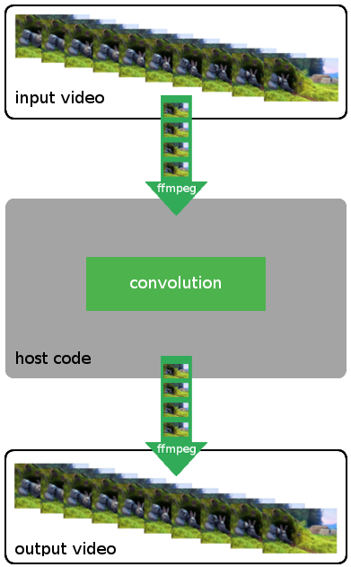

<table class="sphinxhide">
 <tr>
   <td align="center"><h1>2020.1 Vitis™ アプリケーション アクセラレーション開発フロー チュートリアル</h1><a href="https://github.com/Xilinx/Vitis-Tutorials/branches/all">2019.2 Vitis アプリケーション アクセラレーション開発フロー チュートリアル</a></td>
 </tr>
 <tr>
 <td>
 </td>
 </tr>
</table>

# 1\. 元のアプリケーションの評価

このチュートリアルで使用する C アプリケーションは、指定のフィルター係数と RGBA ビデオのセットの 2D たたみ込みを実行します。このアプリケーションは、FFmpeg を使用して入力および出力ビデオ ストリームを作成します。これらのストリームは、入力ビデオの各フレームを読み出し、対応する処理済みフレームを書き出すためのパイプとして使用されます。



この手順では、このアプリケーションをビルドして実行し、アクセラレーション前の元のアプリケーションのベースラインとなるパフォーマンス データを作成します。元のアプリケーションの出力はゴールデン データとして保存し、ハードウェア アクセラレーションされたアプリケーションの出力と比較して検証するために使用します。

## C アプリケーションのビルド

1. 元のアプリケーション コードを含む `cpu_src` ディレクトリに移動します。

2. 次の `make` コマンドを実行します。

   ```
   cd convolution-tutorial/design/cpu_src
   make
   ```

このコマンドを実行すると、C ソース コードがコンパイルされ、`convolve` 実行ファイルが作成されます。実行ファイルには、ビデオ ファイルへのパスが必要です。このチュートリアルでは、ビデオ ファイルはプロジェクトのルート ディレクトリに含まれます。

> **ヒント:** この演習で使用される makefile には、多くの手順と変数が含まれます。makefile の構造および内容については、[makefile の理解](./HowToRunTutorial.md)を参照してください。

## C アプリケーションの実行とゴールデン結果の生成

この手順では、次のコマンドを使用して、元の C アプリケーションを別の形式の指定された入力ビデオ ファイルで実行し、比較用のゴールデン出力ファイルを生成します。

```
cd convolution-tutorial/design/cpu_src
make golden
```

生成された最初の出力ファイル `golden_out_full.mp4` は 132 フレームのフル ビデオで、各フレームは 1980x1080 ピクセルです。ハードウェアではアプリケーションを高速に実行できるので、このゴールデン出力ファイルをすべてのハードウェア実行に使用します。エミュレーションでは、よりすばやく結果を出すために、1 つのフレームのみを含む小さなファイルを使用します。

生成されたゴールデン出力ファイルのサマリは、次のとおりです。

- `golden_out_full.mp4`: ハードウェアで実行する際のアクセラレーション アプリケーションのテストに使用します。
- `golden_out_small.mp4`: 「手順 5: 順不同キューと複数の計算ユニットの使用」以外のソフトウェアおよびハードウェア エミュレーション実行のテストに使用します。
- `golden_out_small_40.mp4`: 「手順 5: 順不同キューと複数の計算ユニットの使用」のテストに使用します。

## アプリケーションのプロファイルとパフォーマンス目標の決定

『Vitis 統合ソフトウェア プラットフォームの資料』 (UG1416) のアプリケーション アクセラレーション開発フローの [Vitis 統合ソフトウェア プラットフォームでのアプリケーション アクセラレーション手法](https://japan.xilinx.com/cgi-bin/docs/rdoc?v=2020.1;t=vitis+doc;d=methodologyacceleratingapplications.html)に説明されているように、`gprof` ツールを使用してアプリケーションプロファイリングし、アクセラレーションするのに適した関数を特定できます。

1. gcc コマンド ラインに `-pg` オプションを追加します。

   これには既に `Makefile` に含まれています。

2. ディレクトリを `cpu_src` フォルダーに変更して、`make` で実行ファイルを生成します。

   ```
   cd cpu_src
   ```

3. 実行ファイルを実行します。

   ```
   ./convolve --gray true ../video.mp4
   ```

4. プロファイル結果を抽出します。

   ```
   gprof convolve gmon.out> gprofresult.txt
   ```

5. プロファイル サマリ レポートを表示するには、テキスト エディターで `gprofresult.txt` ファイルを開きます。次の表のような結果になるはずです。

   各サンプルは 0.01 秒でカウントされます。

   | 時間の割合 (%)| 累積秒数| 個別の秒数| 合計呼び出し数| 呼び出しごとの秒数 (ms)| 呼び出しごとの秒数 (ms)| 名前
   |----------:|----------:|----------:|----------:|----------:|----------:|:----------
   | 95.29| 7.28| 7.28| 132| 55.15| 55.15| convolve\_cpu
   | 4.85| 7.65| 0.37| 132| 2.81| 2.81| grayscale\_cpu
   | 0.00| 7.65| 0.00| 132| 0.00| 0.00| print\_progress(int, int)
   | 0.00| 7.65| 0.00| 1| 0.00| 0.00| GLOBAL\_\_sub\_I\_default\_output

   レポートには、convolve\_cpu に実行時間の 95% が使用されていることが示されます。この関数をアクセラレーションすると、全体的なパフォーマンスが大幅に改善します。

### 達成可能な最大スループットの判断

ほとんどの FPGA アクセラレーション システムでは、達成可能な最大スループットは PCIe® のパフォーマンスによって制限されます。PCIe のパフォーマンスは、マザーボード、ドライバー、ターゲット シェル、転送サイズなどのさまざまな要因の影響を受けます。Vitis コア開発キットに含まれる `xbutil` ユーティリティを使用すると、`xbutil dmatest` コマンドを実行して達成可能な最大 PCIe 帯域幅を求めることができます。デザイン ターゲットのスループットがこの上限を超えることはできません。

### 全体的なアクセラレーション目標の設定

CPU では、132 個の 1920x1080 フレームを処理するのに 19.25 秒かかります。これは、つまり毎秒 132/19.25 =\< 7 フレーム (fps) のパフォーマンスを達成していることを意味します。目標はアプリケーションが 30 fps の最小のリアルタイム パフォーマンスを達成することなので、CPU の約 5 倍の係数でアクセラレーションする必要があります。

フレームのサイズが 1920 x 1080 x 4 バイト = 8.29 MB だとすると、アクセラレーションされたアプリケーションの最小スループットは 8.29 MB x 30 fps = 249 MB/s になります。

このスループット目標は、Alveo データセンター アクセラレータ カードの達成可能な最大スループット以下です。このチュートリアルでは、この目標を達成するプロセスを説明します。

## 次の手順

元のアプリケーションからアクセラレーションのターゲトとする関数を特定し、パフォーマンス目標を決定しました。次の演習では、元の `convolve` 関数をハードウェアで実行してベースラインを作成し、パフォーマンス目標を満たすために一連のホストおよびカーネル コード最適化を実行します。まず、元のアプリケーションから [Vitis コア開発キット アプリケーションを作成](./baseline.md)します。

ハードウェア エミュレーションを実行して、各手順のパフォーマンスを計測します。最後にこれらすべてをハードウェアで実行し、各手順でパフォーマンスがどれだけ改善したかを確認します。</br>

<hr/>
<p align="center" class="sphinxhide"><b><a href="/docs/vitis-getting-started/README.md">入門コースの初めに戻る</a> &mdash; <a href="/docs/convolution-tutorial/README.md">チュートリアルの初めに戻る</a></b></p>
<p align="center" class="sphinxhide"><sup>Copyright&copy; 2020 Xilinx</sup></p>
