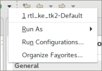
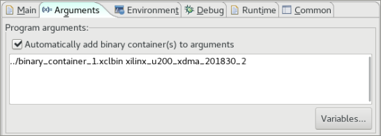

<table class="sphinxhide">
 <tr>
   <td align="center"><h1>2020.1 Vitis™ アプリケーション アクセラレーション開発フロー チュートリアル</h1><a href="https://github.com/Xilinx/Vitis-Tutorials/branches/all">2019.2 Vitis アプリケーション アクセラレーション開発フロー チュートリアル</a></td>
 </tr>
 <tr>
 <td>
 </td>
 </tr>
</table>

# Vitis IDE プロジェクトでの RTL カーネルの使用

> **ヒント**: IP のパッケージ演習で作成した RTL カーネルを Vitis IDE で使用できます。

## ホスト コードの削除とインポート

Vivado ツールを終了すると、次のファイルが Vitis IDE 環境の \[Project Explorer] ビューに追加されます。

- `Vadd_A_B.xo`: コンパイル済みのカーネル オブジェクト ファイル。
- `host_example.cpp`: サンプルのホスト アプリケーション ファイル。

1. \[Project Explorer] ビューで次の図に示すように `src` を展開します。  
![\[Project Explorer] ビュー](./images/192_vitis_project_explorer.PNG)

   > **注記:** `Vadd_A_B.xo` に稲妻アイコンが付いています。Vitis IDE では、これはハードウェア関数であることを示しています。IDE で RTL カーネルが認識され、アクセラレーションされた関数としてマークされます。

2. `host_example.cpp` を選択して削除します。

   この段階で、このチュートリアル用に提供されているホスト アプリケーションをインポートします。

3. \[Project Explorer] ビューで、チュートリアル プロジェクトを右クリックし、**\[Import Sources]** をクリックします。

4. \[From directory] フィールドの **\[Browse]** をクリックして `reference-files/src/host` を指定し、**\[OK]** をクリックします。

5. `host.cpp` を選択してホスト アプリケーション コードをプロジェクトに追加します。

6. \[Into foler] フィールドの **\[Browse]** をクリックして `rtl_ke_t2/src/vitis_rtl_kernel/Vadd_A_B` を指定し、**\[OK]** をクリックします。

7. **\[Finish]** をクリックします。

   `host.cpp` ファイルが `src/vitis_rtl_kernel/Vadd_A_B` フォルダーに追加されます。

8. `host.cpp` をダブルクリックすると、\[Code Editor] ウィンドウが開きます。

## ホスト コードの構造

ホスト コードの構造は、次の 3 つのセクションに分けられます。

1. OpenCL ランタイム環境の設定
2. カーネルの実行
3. FPGA デバイスのポストプロセスとリリース

ホスト アプリケーションと FPGA 間のデータ転送を可能にする重要な OpenCL API 呼び出しの一部を次に示します。

- カーネルへのハンドルを作成します (239 行目)。

  ```C
    clCreateKernel(program, "Vadd_A_B", &err);
  ```

- ホストと FPGA 間のデータ転送用にバッファーを作成します (256 行目)。

  ```C
  clCreateBuffer(context, CL_MEM_READ_WRITE,sizeof(int) * number_of_words, NULL, NULL);
  ```

- 値 (A および B) をバッファーに書き込み、そのバッファーを FPGA に転送します (266 および 274 行目)。

  ```C
  clEnqueueWriteBuffer(commands, dev_mem_ptr, CL_TRUE, 0,sizeof(int) * number_of_words, host_mem_ptr, 0, NULL, NULL);
  ```

- A と B がデバイスに転送された後、カーネルを実行します (299 行目)。

  ```C
  clEnqueueTask(command_queue, kernel, 0, NULL, NULL);
  ```

- カーネルが終了したら、ホスト アプリケーションが新しい B の値を含むバッファーを読み出します (312 行目)。

  ```C
  clEnqueueReadBuffer(command_queue, dev_mem_ptr, CL_TRUE, 0, sizeof(int)*number_of_words,host_mem_output_ptr, 0, NULL, &readevent );
  ```

ホスト アプリケーションの構造および要件の詳細は、『Vitis 統合ソフトウェア プラットフォームの資料』 (UG1416) のアプリケーション アクセラレーション開発フローの[アプリケーションの開発](https://japan.xilinx.com/cgi-bin/docs/rdoc?v=2020.1;t=vitis+doc;d=lhv1569273988420.html)を参照してください。

## ハードウェア関数の追加

ホスト アプリケーション コード (`host.cpp`) および RTL カーネル コード (`Vadd_A_B.xo`) をプロジェクトに追加したら、ハードウェア関数を定義してデバイス バイナリ (`.xclbin` ファイル) を生成します。

1. プロジェクト エディターの \[Hardware Functions] エリアで、 をクリックしてプロジェクトにハードウェア関数を追加します。
2. `Vadd_A_B` 関数を選択します。

## プロジェクトのビルド

ホスト アプリケーション コード (`vadd.cpp`) および RTL カーネル コード (`Vadd_A_B.xo`) をプロジェクトに追加したら、プロジェクトをビルドして実行できます。

> **ヒント**: IP/XO のパッケージ演習で作成した RTL カーネルを Vitis IDE で使用できます。

1. \[Vitis Application Project Settings] で **\[Active build configuration]** を **\[Emulation-HW]** に変更します。  
ハードウェア エミュレーションは、次のような場合に有益です。

   - FPGA に含まれるロジックの機能を検証。
   - アクセラレータおよびホスト アプリケーションの初期パフォーマンス見積もりを取得。

   > **ヒント:** ソフトウェア エミュレーションでは、RTL カーネル フローにそのカーネルの C/C++ ソフトウェア モデルが必要です。このチュートリアルにはそのようなモデルは含まれていないので、ソフトウェア エミュレーション ビルドを実行することはできません。

2. **\[Run]** → **\[Run Configurations]** をクリックします。

   

   rtl\_ke\_t2-Default コンフィギュレーションが既にシステムで作成されています。ホスト コードは、`xclbin` ファイルを読み込む必要があります。これは、引数リストで入力引数として指定する必要があります。

3. **\[Automatically add binary container(s) to arguments]** をオンにします。  
`xclbin` が自動的に検索されて含まれるようになります。ホスト コードを実行する際に、`xclbin` ファイル名の後に 2 つ目の入力引数として `xilinx_u200_xdma_201830_2` を追加します。

4. ハードウェア エミュレーション コンフィギュレーションをビルドして実行し、結果を検証します。

### (オプション) ターゲット プラットフォームでのハードウェアのビルドと実行

1. \[Vitis Application Project Settings] で **\[Active build configuration]** を **\[Hardware]** に変更します。  
システム コンフィギュレーションでは、カーネル コードが FPGA にインプリメントされるので、選択したプラットフォーム カードで実行されるバイナリが生成されます。

2. 使用可能なハードウェア プラットフォームがある場合は、ハードウェアをビルドして実行し、結果を検証してください。

# まとめ

1. Vitis IDE から RTL Kernel ウィザードを使用し、既存の RTL IP に基づいて、新しい RTL カーネルの名前とインターフェイスを指定しました。

   - RRTL Kernel ウィザードを使用して指定した仕様で XML テンプレートを作成し、これらの仕様に合ったサンプル RTL カーネル用のファイルを自動的に生成して、Vivado Design Suite を起動しました。


2. Vivado Design Suite でサンプルの RTL ファイルを削除して、独自の RTL IP ファイルを追加しました。

3. テストベンチを使用して IP をシミュレーションし、AXI Verification IP (AXI VIP) を組み込みました。

4. RTL IP プロジェクトを Vitis IDE で必要とされるコンパイル済み XO ファイルにパッケージしました。

5. RTL カーネルをホスト アプリケーションに追加し、\[Hardware Emulation] コンフィギュレーションをビルドしました。

   - Vitis IDE で、XO ファイルを使用してバイナリ コンテナーを作成し、`xclbin` ファイルをコンパイルしました。</br>

<hr/>
<p align="center" class="sphinxhide"><b><a href="/README.md">入門コースの初めに戻る</a> &mdash; <a href="./README.md">チュートリアルの初めに戻る</a></b></p>
<p align="center" class="sphinxhide"><sup>Copyright&copy; 2020 Xilinx</sup></p>
