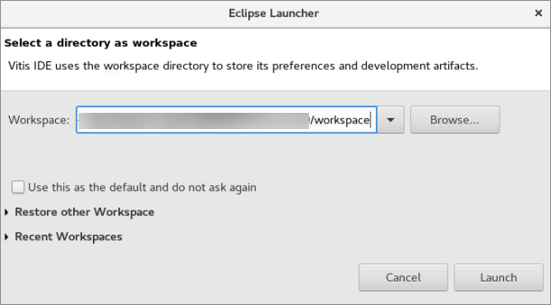
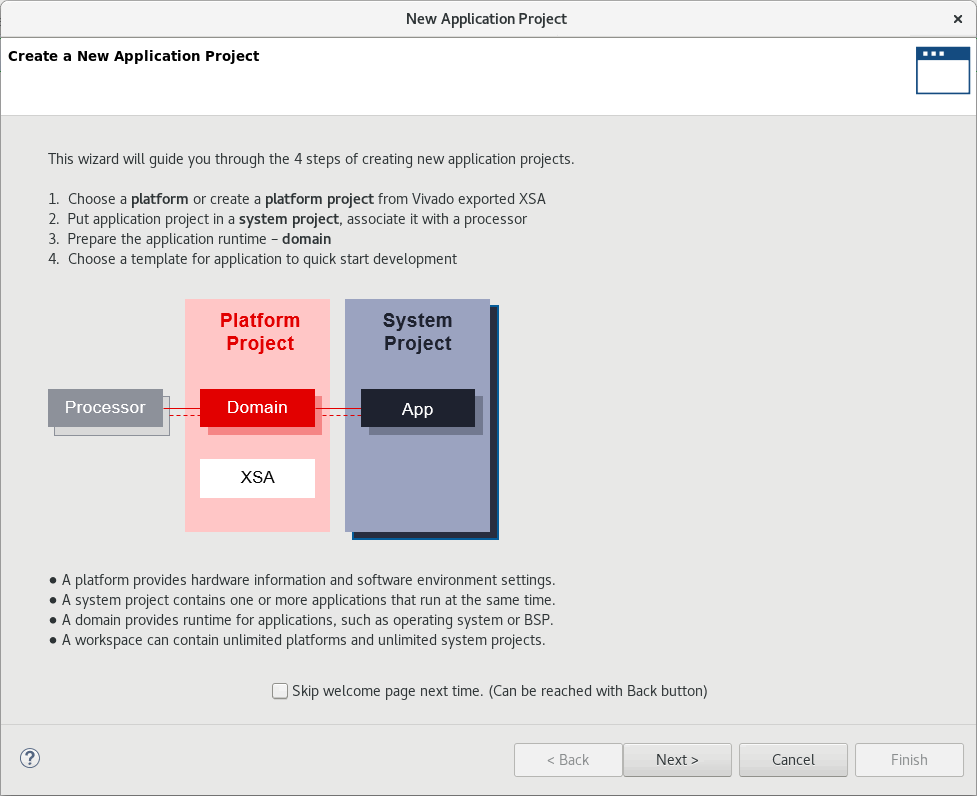
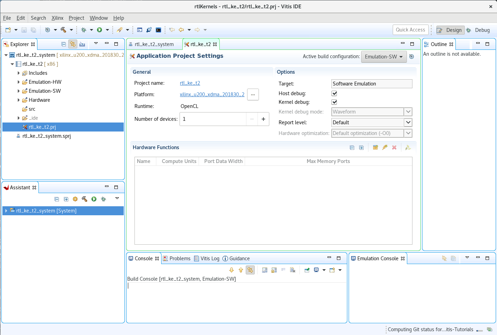
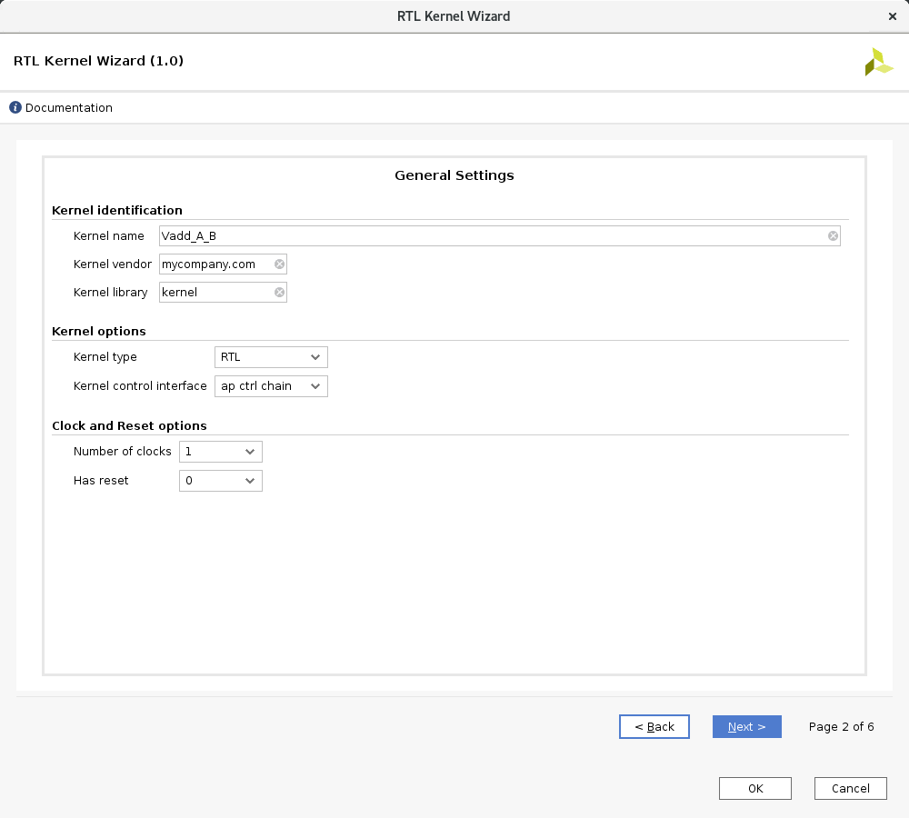

<table class="sphinxhide">
 <tr>
   <td align="center"><h1>2020.1 Vitis™ アプリケーション アクセラレーション開発フロー チュートリアル</h1><a href="https://github.com/Xilinx/Vitis-Tutorials/branches/all">2019.2 Vitis アプリケーション アクセラレーション開発フロー チュートリアル</a></td>
 </tr>
 <tr>
 <td>
 </td>
 </tr>
</table>

# RTL Kernel ウィザードフロー

この演習で説明するプロセスは、『Vitis 統合ソフトウェア プラットフォームの資料』 (UG1416) の [RTL Kernel ウィザード](https://japan.xilinx.com/html_docs/xilinx2020_1/vitis_doc/devrtlkernel.html#ouz1504034324041)に説明されているフローに従っています。

> **重要:** チュートリアルのコマンドを実行する前に、『Vitis 統合ソフトウェア プラットフォームの資料』 (UG1416) のアプリケーション アクセラレーション開発フローの [Vitis 環境の設定](https://japan.xilinx.com/html_docs/xilinx2020_1/vitis_doc/rbk1547656041291.html)に説明されているように、次のコマンドを実行してツール環境を設定する必要があります。
>
> ```bash
>  #setup Xilinx Vitis tools. XILINX_VITIS and XILINX_VIVADO will be set in this step.
>  source <VITIS_install_path>/settings64.sh
>  #Setup Xilinx runtime. XILINX_XRT will be set in this step.
>  source <XRT_install_path>/setup.sh
> ```

1. Linux ターミナル ウィンドウで `vitis` コマンドを入力して Vitis IDE を起動します。  
\[Workspace Launcher] ダイアログ ボックスが表示されます。  


2. ワークスペースのプロジェクト ディレクトリを選択し、**\[Launch]** をクリックします。

3. Vitis IDE が開きます。**\[File]** → **\[New]** → **\[Application Project]** をクリックします。  
New Application Project ウィザードが開きます。  


4. 表示されるプロセスの概要を確認します。**\[Next]** をクリックします。

5. \[Platform] ページが表示されます。`xilinx_u200_xdma_201830_2` を選択し、**\[Next]** をクリックします。  
![\[Platform] ページ](images/rtl_kernel-platform_page.png)

6. \[Application Project Details] ページが表示されます。次を選択します。

   1. プロジェクト名 (例: `rtl_ke_t2`) を入力します。
   2. \[Create New System Project] をオンにします。システム プロジェクト名はプロジェクト名から生成されます。これは、必要に応じて変更できます。
   3. プロセッサは、選択したプラットフォームから自動的に選択されます。


7. **\[Next]** をクリックします。  
\[Templates] ページが開き、プロジェクトの作成に使用可能なテンプレートがリストされます。

8. **\[Empty Application]** を選択し、**\[Finish]** をクリックして Vitis アプリケーション プロジェクトを作成します。

New Application Project ウィザードが閉じ、Vitis IDE に新規プロジェクトが読み込まれます。

# RTL Kernel ウィザードの設定

Vitis IDE のメニュー バーから **\[Xilinx] → \[RTL Kernel Wizard]** をクリックして RTL Kernel ウィザードを起動します。

RTL Kernel ウィザードの Welcome ページが開き、RTL カーネルの定義プロセスの概要が表示されます。このチュートリアルでは、このプロセスに従います。手順を読んで確認し、**\[Next]** をクリックします。

RTL Kernel ウィザードでは、RTL カーネルのインターフェイス機能を指定できます。RTL Kernel ウィザードを使用すると、RTL IP を Vitis IDE でシステムに統合可能な有効なカーネルに確実にパッケージできます。また、RTL IP をカーネルにパッケージするために必要ないくつかのタスクが自動化されます。

RTL Kernel ウィザードは次を生成します。

- RTL デザインを Vitis コア開発キット カーネルの XO ファイルとしてパッケージするのに必要な XML ファイル
- `A[i] = A[i] + 1` を実行するサンプル カーネル (RTL コード、テストベンチ、およびホスト コード)
- カーネル用の Vivado Design Suite プロジェクト

このチュートリアルの後半部分では、このサンプル カーネルを既存の Vector-Accumulate IP に置き換えて、XO ファイルとしてパッケージします。

## \[General Settings] ページ

次の図に示す \[General Settings] ページが表示されます。



- **\[Kernel Identification]**: IP の VLNV (Vendor:Library:Name:Version) を指定します。カーネル名は、RTL カーネルに使用する IP の最上位モジュール名と同じにする必要があります。
- **\[Kernel Options]**: デザイン タイプを指定します。
  - **\[RTL]** (デフォルト): 関連ファイルを Verilog 形式で生成します。
  - **\[Block design]**: Vivado ツールの IP インテグレーター用のブロック デザインを生成します。ブロック デザインには、制御レジスタをエミュレートするため、ブロック RAM 交換メモリを使用する MicroBlaze™ サブシステムが含まれます。
- **\[Clock and Reset Options]**: カーネルで使用されるクロック数およびカーネルに最上位リセット ポートが必要かどうかを指定します。

次を選択します。

1. **\[Kernel name]** に `Vadd_A_B` と入力します。
2. **\[Kernel control interface]** で `ap_ctrl_chain` を選択します。
3. 残りのオプションはデフォルトのままにして、**\[Next]** をクリックします。

## \[Scalars] ページ

スカラー引数は、ホスト アプリケーションからカーネルへ入力パラメーターを渡すために使用されます。指定した \[Number of scalar kernel input arguments] の数に応じて、ソフトウェアからハードウェアに引数を渡すための制御レジスタが作成されます。各引数には ID 値が付けられ、ホスト アプリケーションからその引数にアクセスするために使用されます。この ID 値は、ウィザードのサマリ ページに表示されます。

- **\[Argument name]**: 引数の名前。
- **\[Argument type]**: ネイティブ C/C++ データ型として記述されるスカラー引数型。(u)char、(u)short、(u)int などがあります。

デフォルト値のままにして、**\[Next]** をクリックします。  
![\[Scalar] ページ](./images/rtl_kernel-scalar_page.png)

## \[Global Memory] ページ

グローバル メモリは、ホストとカーネル間、カーネルとその他のカーネル間で大型のデータ セットを渡すため使用されます。このメモリには、カーネルから AXI4 マスター インターフェイスを介してアクセスできます。AXI4 マスター インターフェイスごとに、インターフェイス名、データ幅、関連する引数の数を指定できます。

- **\[Number of AXI master interfaces]**: カーネルの AXI インターフェイス数を指定します。

- **\[AXI master definition]**: インターフェイス名、データ幅 (バイト)、各 AXI インターフェイスの引数の数を指定します。

- **\[Argument definition]**: 各 AXI インターフェイスに割り当てるポインター引数を指定します。各引数には ID 値が付けられ、ホスト アプリケーションからその引数にアクセスするために使用されます。この ID 値の割り当ては、ウィザードのサマリ ページに表示されます。

  ![\[Global Memory] ページ](./images/rtl_kernel-global_memory.png)  
次のように設定します。

1. Vector-Accumulate カーネルには 2 つの AXI4 インターフェイスがあるので、\[Number of AXI master interfaces] は **2** にします。
2. \[AXI master definition] セクションは次のように設定します。
   1. [Interface name] は変更しません。
   2. [Width] は変更しません。
   3. AXI4 インターフェイスはそれぞれ 1 つのポインター引数専用なので、\[Number of arguments] は **1** にします。
3. \[Argument definition] セクションの \[Argument name] は次のように設定します。
   1. \[m00\_axi] には `A` と入力します。  
データセット A にはこの AXI4 インターフェイスを介してアクセスします。
   2. \[m01\_axi] には `B` と入力します。  
データセット B にはこの AXI4 インターフェイスを介してアクセスします。
4. **\[Next]** をクリックします。

## \[Streaming Interfaces] ページ

このデザインには、デザイン ストリーミング インターフェイスは必要ありません。デフォルト値のままにして、**\[Next]** をクリックします。

## \[Summary] ページ

\[Summary] ページには、RTL Kernel ウィザードのさまざまなページで指定した設定のサマリが表示されます。このサマリが正しいことを確認します。

- **\[Target platform]**: RTL カーネルがコンパイルされるプラットフォームを表示します。別のプラットフォームがサポートされるようにするには、RTL カーネルをリコンパイルする必要があります。

- **\[Function prototype]**: カーネル呼び出しが C 関数でどのように記述されるかを示します。

- **\[Register map]**: ホスト ソフトウェア ID、引数名、ハードウェア レジスタ オフセット、データ型、関連する AXI インターフェイス間の関係を表示します。![\[Summary] ページ](./images/rtl_kernel-summary_page.png)

  RTL Kernel ウィザードは、\[Summary] ページ示される設定を使用して、次を生成します。

  - カーネル記述 XML ファイル `kernel.xml`: `/reference-files/src/xml` に含まれ、レジスタ マップなどの Vitis コア開発キットおよびザイリンクス ランタイム (XRT) で必要なカーネルの属性を定義します。
  - `A[i]=A[i]+1` をインプリメントする VADD というサンプル カーネル。次が含まれます。
    - RTL コード
    - 検証テストベンチ
    - ホスト コード
    - VADD サンプルカーネル用の Vivado Design Suite プロジェクト

**\[OK]** をクリックして Vivado Design Suite を起動し、RTL IP をパッケージしてカーネルを作成します。

## 次の手順

次の手順では、RTL デザインを [Vivado Design Suite の IP としてパッケージ](./vivado_ip.md)します。</br>

<hr/>
<p align="center" class="sphinxhide"><b><a href="/README.md">メイン ページに戻る</a> &mdash; <a href="./README.md">このチュートリアルの初めに戻る</a></b></p>
<p align="center" class="sphinxhide"><sup>Copyright&copy; 2020 Xilinx</sup></p>
