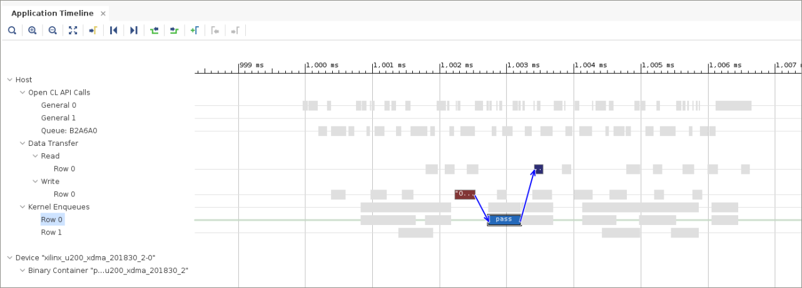

<table class="sphinxhide">
 <tr>
   <td align="center"><h1>2020.1 Vitis™ アプリケーション アクセラレーション開発フロー チュートリアル</h1><a href="https://github.com/Xilinx/Vitis-Tutorials/branches/all">2019.2 Vitis アプリケーション アクセラレーション開発フロー チュートリアル</a></td>
 </tr>
 <tr>
 <td>
 </td>
 </tr>
</table>

# ホスト コードの最適化

## 概要

このチュートリアルでは、FPGA アクセラレーション アプリケーションに関連するホスト コードのパフォーマンスを調整する方法について説明します。ホスト コードの最適化は、パフォーマンス最適化の 1 つにすぎません。ホスト コードの最適化には、次の最適化が含まれます。

* ホスト プログラムの最適化
* カーネル コードの最適化
* トポロジの最適化
* インプリメンテーションの最適化

## チュートリアルの概要

このチュートリアルでは、1 つの単純な C++ カーネル インプリメンテーションを使用することにより、ホスト コード インプリメンテーションの解析からカーネル コードの修正、トポロジの最適化、およびインプリメンテーションの選択に関する要素を取り除いています。

> **注記:** このチュートリアルでは、ホスト コード最適化手法のアクセラレータの統合を最適化する点についてのみ説明します。複数の CPU コアの使用、ホスト コードでのメモリの管理など、その他のよく使用される手法については説明しません。詳細は、『Vitis 統合ソフトウェア プラットフォームの資料』 (UG1416) のアプリケーション アクセラレーション開発フローの[アプリケーションのプロファイル、最適化、およびデバッグ](https://japan.xilinx.com/cgi-bin/docs/rdoc?v=2020.1;t=vitis+doc;d=wzc1553475252001.html)を参照してください。

次のセクションでは、ホスト コードの最適化に関する次の注意点について説明します。

* ソフトウェア パイプライン/イベント キュー
* カーネルおよびホスト コードを同期
* バッファー サイズ

## 開始前の確認事項

このチュートリアルでは、次を使用します。

* BASH Linux シェル コマンド
* 2020.1 Vitis コア開発キット リリースおよび xilinx\_u200\_xdma\_201830\_2 プラットフォーム。  
必要であれば、ほかのバージョンおよびプラットフォームを使用するように変更することもできます。

> **重要:**
>
> * 例を実行する前に、『Vitis 統合ソフトウェア プラットフォームの資料』 (UG1416) のアプリケーション アクセラレーション開発フローの[インストール](https://japan.xilinx.com/html_docs/xilinx2020_1/vitis_doc/vhc1571429852245.html)の手順に従って、Vitis コア開発キットをインストールしてください。
> * ザイリンクス Alveo™ データセンター アクセラレータ カードでアプリケーションを実行する場合は、[Alveo ポートフォリオ](https://japan.xilinx.com/products/boards-and-kits/alveo.html) ページの手順に従って、カードとソフトウェア ドライバーを正しくインストールしてください。

### チュートリアル リファレンス ファイルの入手

1. リファレンス ファイルを入手するには、ターミナルに `git clone https://github.com/Xilinx/Vitis-Tutorials` と入力します。
2. `host-opt-code` ディレクトリに移動し、`reference-files` ディレクトリにアクセスします。

## モデル

この例では、カーネルはホスト コードを最適化するためにのみ作成します。ホスト コードの最適化の影響がわかるように、このチュートリアル全体で同じものを使用します。

<!--this could be better suited as a table-->
C++ カーネルには、入力ポートと出力ポートが 1 つずつあります。これらのポートの幅は、AXI 帯域幅を最適に使用するため、512 ビットにしています。実行ごとにカーネルで消費される要素数は、`numInputs` パラメーターで設定できます。同様に、`processDelay` パラメーターを使用すると、カーネルのレイテンシを変更できます。このアルゴリズムは、入力値を `ProcessDelay` の値分増加しますが、これは、入力値を 1 回に 1 ずつ、`processDelay` 回増加するループを実行することによりインプリメントされます。このループはカーネル インプリメンテーション内にあるので、反復ごとに一定量のサイクル数が必要で、これを `processDelay` 値で乗算できます。

カーネルでは、AXI バースト転送もイネーブルにできます。カーネルには読み出しおよび書き込みプロセスが含まれ、プロセスの終わりの方で実際のカーネル アルゴリズム (`exec`) と並列に実行されます。読み出しおよび書き込みプロセスは AXI トランザクションを単純なループで開始し、受信した値を内部 FIFO に書き込むか、内部 FIFO から読み出して AXI 出力に書き込みます。これらを含む `pass_dataflow` 関数に DATAFLOW プラグマがで設定されているので、Vitis コンパイラでこれらのブロックが同時並列プロセスとしてインプリメントされます。

## カーネルのビルド

> **注記:** このチュートリアルでは、すべての手順を `reference-files` ディレクトリから実行します。

ホスト コードにはハードウェア エミュレーションでうまく実行できるものもありますが、正確なランタイム情報の取得および大型のテスト ベクターの実行には、実際のアクセラレータ カード ハードウェア上でカーネルを実行する必要があります。通常、カーネルはホスト コードの最適化中には変更されないので、このチュートリアルではカーネルをハードウェアにコンパイルする必要があるのは 1 回だけです。

次の makefile コマンドを実行して、カーネルを特定のアクセラレータ カードにコンパイルします。

```
make TARGET=hw DEVICE=xilinx_u200_xdma_201830_2 kernel
```

> **注記:** このビルド プロセスには数時間かかりますが、ホスト コードの最適化がパフォーマンスにどのように影響するかを解析する前に、カーネルをコンパイルしておく必要があります。

## ホスト コード

ホスト コードのさまざまなインプリメンテーション オプションを検証する前に、コードの構造を確認します。ホスト コード ファイルは、ホスト コード最適化の重要な点に集中できるように設計されています。

共通ソース ディレクトリ (`srcCommon`) のヘッダー ファイルには、次の 3 つのクラスが含まれます。

* `srcCommon/AlignedAllocator.h`: `AlignedAllocator` は 2 つのメソッドを含む小型の構造体です。この構造体は、テスト ベクターのメモリ アライメントされた割り当てをサポートするヘルパー クラスとして提供されています。メモリ アライメントされたブロックのデータは高速に転送でき、送信されたデータがメモリ アライメントされていない場合は OpenCL™ API ライブラリで警告が作成されます。

* `srcCommon/ApiHandle.h`: 次の主な OpenCL API オブジェクトをカプセル化します。

  * context
  * program
  * `device_id`
  * execution kernel
  * `command_queue`

  これらの構造はコンストラクターで作成され、OpenCL API 関数呼び出しのデフォルト シーケンスを 1 つずつ実行します。コンストラクターには、次の 2 つの設定パラメーターがあります。

  * FPGA をプログラムするのに使用するビットストリーム (`xclbin`) の名前を含む文字列。
  * 順不同キューを作成するか、順序どおりの実行キューを作成するかを指定するブール値。

  このクラスには、バッファーの生成およびアクセラレータでのタスクのスケジューリングに必要なキュー、コンテキスト、カーネルへの補足的な関数が含まれます。また、ApiHandle デストラクターが呼び出されると、自動的に割り当てられた OpenCL API オブジェクトが解放されます。

* `srcCommon/Task.h`: オブジェクト クラス `Task` は、アクセラレータで実行されるワークロードの 1 つのインスタンスを示します。このクラスのオブジェクトが作成されると、バッファー サイズに基づいて入力および出力ベクターが割り当てられて初期化され、タスク呼び出しごとに転送されます。同様に、デストラクターはタスク実行中に生成されたオブジェクトの割り当てを解除します。

  > **注記:** このように 1 つのモジュールの呼び出しに 1 つのワークロードをカプセル化すると、このクラスに出力検証関数 (`outputOk`) も含めることができます。

  このクラスのコンストラクターには、次の 2 つのパラメーターが含まれます。

  * `bufferSize`: このタスクが実行されるときに転送される 512 ビット値の数を指定します。
  * `processDelay`: 同様の名前のカーネル パラメーターを提供します。検証中にも使用されます。

  このクラスで最も重要なメンバー関数は、`run` です。この関数は、アルゴリズムを実行するため、次の 3 つの手順をエンキューします。

  1. FPGA アクセラレータにデータを書き込む
  2. カーネルを設定してアクセラレータを実行
  3. FPGA アクセラレータからデータを戻す

  これらを実行するため、通信用にバッファーが DDR に割り当てられます。また、異なるコマンド間の依存性 (実行前に書き込み、読み出し前に実行) を作成するために、イベントが使用されます。

  `run` 関数には、ApiHandle オブジェクトに加え、1 つの条件引数があります。この引数を使用すると、タスクを前に生成したイベントに依存するようにでき、このチュートリアルの後半で説明するように、ホスト コードでタスク順の依存性を構築できます。

  これらのヘッダー ファイルのコードは、このチュートリアル中には変更されません。主な概念は、次のフォルダーに含まれる異なる `host.cpp` ファイルに記述されています。

  * `srcBuf`
  * `srcPipeline`
  * `srcSync`

  ただし、`host.cpp` ファイルの main 関数は、次のセクションに説明する特別な構造に従います。

### host.cpp の main 関数

main 関数には、次のセクションが含まれます。

1. **Environment / Usage Check**
2. **Common Parameters**
   * `numBuffers`: 変更されないパラメーターです。カーネルの実行回数を指定するために使用します。
   * `oooQueue`: ApiHandle 内で生成される OpenCL イベント キューのタイプを宣言するために使用されます。
   * `processDelay`: カーネルで必要な計算時間を遅らせます。このパラメーターは、このバージョンのチュートリアルでは使用しません。
   * `bufferSize`: カーネル実行ごとに転送される 512 ビット値の数を宣言します。
   * `softwarePipelineInterval`: 同期の前に前もってスケジュール可能な演算の数を指定します。
3. **Setup**: 設定変数のステータスを知らせるため、最終的な設定を表示します。
4. **Execution**: 複数の異なるホスト コードのパフォーマンス問題をモデル化できます。このチュートリアルでは、これらの行について説明します。
5. **Testing**: 実行の完了後、出力で単純なチェックを実行します。
6. **Performance Statistics**: モデルをエミュレーションではなく実際のアクセラレータ カードで実行した場合に、ホスト コードでシステム時間の計測に基づいてパフォーマンス統計が計算され表示されます。

> **注記:** setup セクションだけでなくその他のセクションも、システム ステータスや、実行の全体的な `PASS` または `FAIL` を記録するメッセージを表示できます。

### 順不同イベント キューを使用してパイプライン処理済みのカーネルを実行

この演習では、パイプライン処理されたカーネルを実行します。

> **注記:** 1 つの計算ユニット (CU) (カーネルのインスタンス) を扱っているので、結果的にハードウェアで実際に実行できるカーネルは 1 つだけです。前述のように、カーネルの実行には、データが CU から送受信される必要もあります。これらの操作をパイプライン処理して、カーネルのアイドル時間を最小限に抑える必要があります。

1. 次のコマンドを使用して、ホスト コード (`srcPipeline/host.cpp`) をコンパイルして実行します。

   ```
   make TARGET=hw DEVICE=xilinx_u200_xdma_201830_2 pipeline
   ```

   カーネルのコンパイル時間と比べると、ビルド段階は短時間で実行されます。

   ホスト コードの 55 行目から開始する実行ループを見てみます。

   ```cpp
    // -- Execution -----------------------------------------------------------

    for(unsigned int i=0; i < numBuffers; i++) {
      tasks[i].run(api);
    }
    clFinish(api.getQueue());
   ```

   コードですべてのバッファーがスケジュールされて実行されるようになっています。実際に同期して完了を待つのは最後の行です。

2. アプリケーションを実行する準備が完了しました。

   次の内容を含む `xrt.ini` ファイルで指定した設定により、ランタイム データがホスト プログラムで生成されます。

   このファイルは、`./reference-files/auxFiles/xrt.ini` にも含まれており、`runPipeline` ディレクトリにコピーされるはずです。`make` コマンドで自動的にコピーされます。

   ```
   [Debug]
   profile=true
   timeline_trace=true
   data_transfer_trace=coarse
   stall_trace=all
   ```

   `xrt.ini` ファイルの詳細は、『Vitis 統合ソフトウェア プラットフォームの資料』 (UG1416) のアプリケーション アクセラレーション開発フローの [Vitis 環境リファレンス資料](https://japan.xilinx.com/cgi-bin/docs/rdoc?v=2020.1;t=vitis+doc;d=yxl1556143111967.html)を参照してください。

   次のコマンドを使用してアプリケーションを実行します。

   ```
   make TARGET=hw DEVICE=xilinx_u200_xdma_201830_2 pipelineRun
   ```

   実行が完了したら、Vitis アナライザーの左側のペインで \[Application Timeline] を選択してアプリケーション タイムラインを開きます。

   ```
   vitis_analyzer runPipeline/pass.hw.xilinx_u200_xdma_201830_2.xclbin.run_summary
   ```

   \[Application Timeline] ビューには、実行ファイルの実行全体が示されます。このタイムラインには、主に次の 3 つのセクションが含まれます。

   * \[OpenCL API Calls]
   * \[Data Transfer]
   * \[Kernel Enqueues]

3. 実際のアクセラレータ実行を示すセクションを拡大し、カーネル エンキューの 1 つを選択すると、次のような画面が表示されます。

   青の矢印は依存性を示します。すべての書き込み/実行/読み出しタスクの実行が前の書き込み/実行/読み出し演算セットに依存しており、実行は順次になります。

   この場合、依存性は順序どおりのキューを使用して作成されます。`host.cpp` の 27 行目の parameter セクションでは、`oooQueue` パラメーターが `false` に設定されています。

   ```cpp
    bool         oooQueue                 = false;
   ```

   この依存性は、順不同 (\`oooQueue\`) パラメーターを `true` に変更するとなくなります。

   ```cpp
    bool         oooQueue                 = true;
   ```

4. 再コンパイルして実行します。

   ```
   make TARGET=hw DEVICE=xilinx_u200_xdma_201830_2 pipeline
   make TARGET=hw DEVICE=xilinx_u200_xdma_201830_2 pipelineRun
   ```

   \[Application Timeline] ビューを拡大してカーネル キューの結果をクリックすると、次の図のような表示になります。

   ほかの pass カーネル エンキューを選択すると、10 個すべての依存性が書き込み/実行/読み出しグループ内でのみ表示されるようになります。これで読み出しと書き込みをオーバーラップできるようになり、ソフトウェアの書き込み、実行、読み出しが効率的にパイプライン処理されます。通信のオーバーヘッドがアクセラレータの実行と同時に発生するので、全体的なパフォーマンスが大幅に向上します。

### カーネルおよびホスト コードを同期

ここでは、まず `srcSync` (`srcSync/host.cpp`) のソース コードの実行ループを確認します (55 行目)。これは、このチュートリアルの前のセクションで使用したのと同じコードです。

```cpp
  // -- Execution -----------------------------------------------------------

  for(unsigned int i=0; i < numBuffers; i++) {
    tasks[i].run(api);
  }
  clFinish(api.getQueue());
```

この例では、フリーランニング パイプラインがインプリメントされます。同期は、イベント キューで `clFinish` への呼び出しが実行されるまで実行されません。これで効率的なパイプラインは作成されますが、インプリメンテーションでバッファーの割り当てと実行順序に関する問題が発生します。これは、バッファーが不要になり、同期ポイントが暗示されないとバッファーを解放できないからです。

たとえば、ビデオ ストリームを処理する場合など、numBuffer 変数を大きくすると問題となることがあります。この場合、ホスト メモリがあらかじめ割り当てられて FPGA と共有されるので、バッファーの割り当てとメモリ使用量が問題となる可能性があります。この例ではメモリ不足が発生します。

同様に、アクセラレータを実行する呼び出しがそれぞれ独立していて、同期されていない (順不同キュー) ので、異なる呼び出し間の実行順がエンキューの順序と一致しない可能性があります。この結果、ホスト コードが特定のブロックが終了するのを待つ場合に、実行が予測よりも遅れる可能性があります。これにより、アクセラレータが実行されているときのホスト コードの並列処理が実質的にディスエーブルになります。

この問題を軽減するため、OpenCL フレームワークには 2 つの同期方法があります。

* `clFinish` 呼び出し
* `clWaitForEvents` 呼び出し

1. まず、`clFinish` 呼び出しを確認します。この動作を確認するため、実行ループを次のように変更します。

   ```cpp
   // -- Execution -----------------------------------------------------------

   int count = 0;
   for(unsigned int i=0; i < numBuffers; i++) {
     count++;
     tasks[i].run(api);
     if(count == 3) {
       count = 0;
       clFinish(api.getQueue());
     }
   }
   clFinish(api.getQueue());
   ```

2. 再コンパイルして実行します。

   ```
   make TARGET=hw DEVICE=xilinx_u200_xdma_201830_2 sync
   make TARGET=hw DEVICE=xilinx_u200_xdma_201830_2 syncRun
   ```

3. 実行が完了したら、Vitis アナライザーの左側のペインで \[Application Timeline] を選択してアプリケーション タイムラインを開きます。

   ```
   vitis_analyzer runSync/pass.hw.xilinx_u200_xdma_201830_2.xclbin.run_summary
   ```

   \[Application Timeline] ビューを拡大すると、次のように表示されます。 

   `clFinish` という赤いボックスと、アクセラレータを 3 回呼び出すごとにカーネル エンキュー間のギャップが大きくなっていることに注目してください。

   `clFinish` への呼び出しにより、全 OpenCL コマンド キューに同期ポイントが作成されます。つまり、指定のキューにエンキューされたコマンドは、`clFinish` がホスト プログラムに制御を戻す前にすべて終了している必要があります。このため、バッファーの通信を含むすべての操作を、次の 3 アクセラレータ呼び出しのセットが再開する前に終了する必要があります。これは実質的にバリア同期です。

   これにより、バッファーを解放できる同期ポイントをイネーブルにでき、すべてのプロセスが確実に完了するだけでなく、同期ポイントでのオーバーラップを回避できます。

4. 前のアクセラレータへの呼び出しの終了に基づいて同期を実行する別の同期方法を確認します。`host.cpp` ファイルで実行ループを次のように変更します。

   ```cpp
     // -- Execution -----------------------------------------------------------

     for(unsigned int i=0; i < numBuffers; i++) {
       if(i < 3) {
         tasks[i].run(api);
       } else {
         tasks[i].run(api, tasks[i-3].getDoneEv());
       }
     }
     clFinish(api.getQueue());
   ```

5. 再コンパイルして実行します。

   ```
   make TARGET=hw DEVICE=xilinx_u200_xdma_201830_2 sync
   make TARGET=hw DEVICE=xilinx_u200_xdma_201830_2 syncRun
   ```

   \[Application Timeline] ビューを拡大すると、次のように表示されます。 

   タイムラインの後半では、不必要な間隔なしに pass が 5 回実行されていますが、さらに注目に値するのがマーカーで示した部分でのデータ転送です。この段階では、3 つのパッケージがアクセラレータで処理されるように送信されており、既に 1 つが戻ってきています。最初のアクセラレータの呼び出しが完了したときに次の書き込み/実行/読み出しが実行されるようにしたので、3 つ目のパスが完了する前に次の書き込みが発生しています。実行がオーバーラップしているのが明確にわかります。

   この例では、クラス タスクの `run` メソッドの次のイベント同期を使用して、3 呼び出し前にスケジュールされた実行が完了したときに、次のアクセラレータ全体が実行されるようにしました。

   ```cpp
       if(prevEvent != nullptr) {
         clEnqueueMigrateMemObjects(api.getQueue(), 1, &m_inBuffer[0],
                                   0, 1, prevEvent, &m_inEv);
      } else {
        clEnqueueMigrateMemObjects(api.getQueue(), 1, &m_inBuffer[0],
                                   0, 0, nullptr, &m_inEv);
       }
   ```

   これは OpenCL のエンキューされたオブジェクト間によく使用される同期化方法ですが、次の API を呼び出してホスト コードを同期化する方法もあります。

   ```cpp
     clWaitForEvents(1,prevEvent);
   ```

   これにより、アクセラレータが前にエンキューされたタスクを実行している間に、追加のホスト コード計算を実行できます。これについては、詳細はここでは説明しません。

   > **注記:** この同期方法では、イベントの完了後にホスト コードが動作できるので、バッファー管理スキームをコード記述できます。これにより、長時間実行されるアプリケーションでメモリ不足が発生しなくなります。

### OpenCL API バッファー サイズ

このチュートリアルの最後のセクションでは、バッファー サイズが全体的なパフォーマンスにどのように影響するかを調べます。このセクションの終わりの方では、`srcBuf/host.cpp` のホスト コードに焦点を置きます。実行ループは、前のセクションの最後のものと同じです。

ただし、このホスト コード ファイルでは、処理されるタスク数を 100 に増加しています。この変更は、100 個のアクセラレータ呼び出しを取得し、100 個のバッファーを転送して、100 個のバッファーを読み込むために加えられています。これにより、転送ごとの平均スループットをより正確に見積もることができるようになります。

特定の実行でのバッファー サイズを指定するため、2 つ目のコマンド ライン オプション (`SIZE=`) も追加されています。1 つの書き込みまたは読み出し中に転送される実際のバッファー サイズは、指定した引数の 2 のべき乗 (`pow(2, argument)`) を 512 ビットで乗算して算出されます。

1. ホスト コードをコンパイルします。

   ```
   make TARGET=hw DEVICE=xilinx_u200_xdma_201830_2 buf
   ```

2. 実行ファイルを実行します。

   ```
   make TARGET=hw DEVICE=xilinx_u200_xdma_201830_2 SIZE=14 bufRun
   ```

   引数 `SIZE` は、ホスト実行ファイルへの 2 つ目の引数として使用されます。

   > **注記:** `SIZE` が含まれない場合は、デフォルトで `SIZE=14` に設定されます。これにより、異なるバッファー サイズを使用してインプリメンテーションを実行でき、計算時間合計を監視することによりスループットを測定できるようになります。この値はテストベンチで計算され、FPGA スループット出力でレポートされます。

   異なるバッファー サイズでのスイープ実行を簡単にするため、別の makefile ターゲットが作成されており、次のコマンドで実行できます。

   ```
   make TARGET=hw DEVICE=xilinx_u200_xdma_201830_2 bufRunSweep
   ```

   > **注記:** スイープ スクリプト (`auxFiles/run.py`) には、ほとんどのシステムで使用可能な Python をインストールする必要があります。スイープを実行すると、バッファー サイズ引数 8 ～ 19 での FPGA スループットが記録されます。計測されたスループット値は転送ごとの実際のバイト数と共に `runBuf/results.csv` に記録され、makefile の実行の最後に表示されます。

   これらの値を解析すると、次の図に示すようなステップ関数が表示されます。  


   この図から、バッファー サイズ (X 軸、転送ごとのバイト数) がパフォーマンス (Y 軸、FPGA スループット (MB/s)) に影響しており、約 2 MB で横ばいになり始めることがわかります。

   > **注記:** この図は、Gnuplot を使用して `results.csv` ファイルから作成されています。Gnuplot がシステムに含まれている場合、スイープを実行すると自動的に表示されます。

ホスト コードのパフォーマンスについては、このステップ関数によりバッファー サイズおよび実行速度合計間の関係がわかります。この例で示すように、デフォルト インプリメンテーションが少量の入力データに基づいている場合、アルゴリズムのバッファー サイズは簡単に変更できます。ここで実行したようにランタイムで動的に決定されるようにする必要はありませんが、原則は同じです。アルゴリズムの 1 回の呼び出しに対して 1 つの値セットを送信するのではなく、複数の入力値を送信して、1 つのアクセラレータ呼び出しでアルゴリズムの実行を繰り返します。

## まとめ

このチュートリアルでは、ホスト コードの 3 つの最適化方法を説明しました。

* 順不同イベント キューを使用してパイプライン処理済みのカーネルを実行
* カーネルおよびホスト コードを同期
* OpenCL API バッファー サイズ

効率的なアクセラレーション インプリメンテーションを作成するには、これらについて考慮してください。このチュートリアルでは、これらのパフォーマンス ボトルネックの解析方法と改善方法の 1 つを示しました。

ホスト コードをインプリメントしてパフォーマンスを改善する方法は多数あります。これは、ホストからアクセラレータのパフォーマンス、バッファー管理などの項目の改善にも当てはまります。このチュートリアルでは、ホスト コードの最適化に関するすべての側面について説明したわけではありません。

## 次の手順

アプリケーション パフォーマンスを解析するのに使用するツールおよびプロセスの詳細は、『Vitis 統合ソフトウェア プラットフォームの資料』 (UG1416) のアプリケーション アクセラレーション開発フローの[アプリケーションのプロファイル、最適化、およびデバッグ](https://japan.xilinx.com/cgi-bin/docs/rdoc?v=2020.1;t=vitis+doc;d=wzc1553475252001.html)を参照してください。</br>

<hr/>
<p align="center" class="sphinxhide"><b><a href="/README.md">メイン ページに戻る</a></b></p>
<p align="center" class="sphinxhide"><sup>Copyright&copy; 2020 Xilinx</sup></p>

<p align="center"><sup>この資料は表記のバージョンの英語版を翻訳したもので、内容に相違が生じる場合には原文を優先します。資料によっては英語版の更新に対応していないものがあります。
日本語版は参考用としてご使用の上、最新情報につきましては、必ず最新英語版をご参照ください。</sup></p>