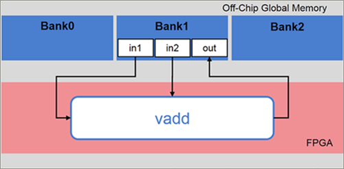
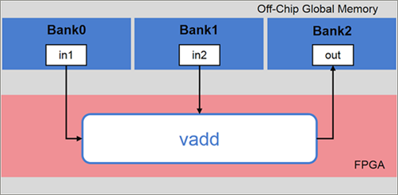

<table class="sphinxhide">
 <tr>
   <td align="center"><h1>2020.1 Vitis™ アプリケーション アクセラレーション開発フロー チュートリアル</h1><a href="https://github.com/Xilinx/Vitis-Tutorials/branches/all">2019.2 Vitis アプリケーション アクセラレーション開発フロー チュートリアル</a></td>
 </tr>
 <tr>
 <td>
 </td>
 </tr>
</table>

# 複数 DDR バンクの使用

## 概要

Vitis™ コア開発キットでは、カーネルと DDR の間のデータ転送に、デフォルトでは 1 つの DDR バンクが使用されます。アプリケーションによっては、データの移動がパフォーマンスのボトルネックになることがあります。カーネルがグローバル メモリ (DDR) と FPGA の間で多量のデータを移動する必要がある場合、複数の DDR バンクを使用できます。これにより、カーネルが複数のメモリ バンクに同時にアクセスできるようになり、アプリケーションのパフォーマンスが向上します。

`v++` コマンドに `--sp` オプションを使用してシステム ポート マップを指定すると、カーネル ポートを DDR や PLRAM などの特定のグローバル メモリ バンクにマップできます。このチュートリアルでは、カーネル ポートを複数の DDR バンクにマップする方法を示します。

## チュートリアルの概要

このチュートリアルでは、単純な Vector Addition サンプルを使用します。このサンプルは、`vadd` カーネルが `in1` および `in2` からデータを読み出し、その結果の `out` を生成します。

このチュートリアルでは、3 つの DDR バンクを使用して Vector Addition アプリケーションをインプリメントします。

Vitis コア開発キットのデフォルトでは、カーネルとグローバル メモリの間のデータ転送に 1 つの DDR バンクが使用され、`in1`、`in2`、および `out` ポートを介するすべてのデータ アクセスがプラットフォームのデフォルト DDR バンクを介して実行されます。



これを、次のようにアクセスするように変更します。

* `in1` は `Bank0` を使用
* `in2` は `Bank1` を使用
* `out` は `Bank2` を使用



必要なマップを達成するには、Vitis コア開発キットで各カーネル引数が適切なバンクに接続されるように設定します。

このチュートリアルの例では C++ カーネルを使用しますが、RTL および OpenCL™ API カーネルでも手順は同じです。

## 開始前の確認事項

このチュートリアルでは、次を使用します。

* BASH Linux シェル コマンド。
* 2020.1 Vitis コア開発キット リリースおよび xilinx\_u200\_xdma\_201830\_2 プラットフォーム。必要であれば、ほかのバージョンおよびプラットフォームを使用するように変更することもできます。

> **重要:**
>
> * 例を実行する前に、『Vitis 統合ソフトウェア プラットフォームの資料』 (UG1416) のアプリケーション アクセラレーション開発フローの[インストール](https://japan.xilinx.com/cgi-bin/docs/rdoc?v=2020.1;t=vitis+doc;d=vhc1571429852245.html)の手順に従って、Vitis コア開発キットをインストールしてください。
> * ザイリンクス Alveo™ データセンター アクセラレータ カードでアプリケーションを実行する場合は、[Alveo ポートフォリオ](https://japan.xilinx.com/products/boards-and-kits/alveo.html) ページの手順に従って、カードとソフトウェア ドライバーを正しくインストールしてください。

### チュートリアル リファレンス ファイルの入手

1. リファレンス ファイルを入手するには、ターミナルに `git clone https://github.com/Xilinx/Vitis-Tutorials` と入力します。
2. `mult-ddr-banks` ディレクトリに移動し、`reference-files` ディレクトリにアクセスします。

### チュートリアルの設定

1. 次のコマンドを実行して Vitis コア開発キットを設定します。

   ```bash
     #setup Xilinx Vitis tools, XILINX_VITIS and XILINX_VIVADO will be set in this step. source <VITIS install path>/settings64.sh. for example:
     source /opt/Xilinx/Vitis/2019.2/settings64.sh
     #Setup runtime. XILINX_XRT will be set in this step
     source /opt/xilinx/xrt/setup.sh
   ```

2. makefile を実行してハードウェア エミュレーション用のデザインをビルドします。

   ```bash
   cd reference-files
   make all
   ```

   > **makefile オプションの説明**
   >
   > * `MODE := hw_emu`: ビルド コンフィギュレーション モードをハードウェア エミュレーションに設定します。
   > * `PLATFORM := xilinx_u200_xdma_201830_2`: ターゲット プラットフォームを選択します。
   > * `KERNEL_SRC := src/vadd.cpp`: カーネル ソース ファイルをリストします。
   > * `HOST_SRC := src/host.cpp`: ホスト ソース ファイルをリストします。

   前述のように、デザインのデフォルト インプリメンテーションでは 1 つの DDR バンクが使用されます。\[Console] ビューにリンク段階で表示されるメッセージを確認します。次のようなメッセージが表示されるはずです。

   ```
   ip_name: vadd
   Creating apsys_0.xml
   INFO: [CFGEN 83-2226] Inferring mapping for argument vadd_1.in1 to DDR[1]
   INFO: [CFGEN 83-2226] Inferring mapping for argument vadd_1.in2 to DDR[1]
   INFO: [CFGEN 83-2226] Inferring mapping for argument vadd_1.out to DDR[1]
   ```

   Vitis コア開発キットにより、`--sp` が設定されていない各カーネル引数に対してマップが自動的に推論されているのがわかります。

3. makefile に `check` オプションを付けて、ハードウェア エミュレーションを実行します。

   ```bash
   make check
   ```

   シミュレーションが終了すると、次に示すようにカーネル データ転送のメモリ接続がレポートされます。

   ```
   TEST PASSED
   INFO: [Vitis-EM 22] [Wall clock time: 22:51, Emulation time: 0.0569014 ms] Data transfer between kernel(s) and global memory(s)
   vadd_1:m_axi_gmem0-DDR[1]          RD = 0.391 KB               WR = 0.000 KB
   vadd_1:m_axi_gmem1-DDR[1]          RD = 0.391 KB               WR = 0.000 KB
   vadd_1:m_axi_gmem2-DDR[1]          RD = 0.000 KB               WR = 0.391 KB
   ```

この後、データ転送を次の 3 つに分割する方法を示します。

* `DDR Bank 0`
* `DDR Bank 1`
* `DDR Bank 2`

## v++ リンカー オプションの設定

`v++` カーネル リンカーでカーネル引数が対応するバンクに接続されるように設定します。`sp` オプションを使用して、カーネル ポートまたはカーネル引数をマップします。

* **カーネル引数**

  ```
    sp = <kernel_cu_name>.<kernel_arg>:<sptag>
  ```

  * `<kernel_cu_name>`: 計算ユニット (CU) 名。カーネル名にアンダースコア (`_`) と値 `1` から開始するインデックス (`index`) を付けたものになります。たとえば、vadd カーネルの計算ユニットの名前は `vadd_1` などになります。
  * `<kernel_arg>`: CU の関数引数。vadd カーネルのカーネル引数は、`vadd.cpp` ファイルに含まれます。
  * `<sptag>`: ターゲット プラットフォームで使用可能なメモリ リソース。有効な `<sptag>` 名は DDR、PLRAM などです。このチュートリアルでは、`DDR[0]`、`DDR[1]`、および `DDR[2]` をターゲットにします。`<sptag>[min:max]` のようにすると、範囲を指定できます。

1. vadd カーネルの `sp` コマンド オプションを定義し、これを makefile に追加します。

   カーネル インスタンス名は `vadd_1` になります。vadd カーネルのカーネル引数は、`vadd.cpp` ファイルで指定します。カーネル引数 (`in1`、`in2`、および `out`) を `DDR[0]`、`DDR[1]`、および `DDR[2]` に接続する必要があるので、  
`sp` オプションは次のようになります。

   ```
   sp = vadd_1.in1:DDR[0]
   sp = vadd_1.in2:DDR[1]
   sp = vadd_1.out:DDR[2]
   ```

   * 引数 `in1` は DDR Bank0 にアクセス
   * 引数 `in2` は DDR Bank1 にアクセス
   * 引数 `out` は DDR Bank2 にアクセス

   3 つの `sp` オプションが `connectivity.cfg` ファイルに追加され、その config ファイルを使用するために makefile を変更する必要があります。

2. makefile を開いて 18 行目のコメントをはずし、config ファイルが `v++` リンカー オプションに追加されるようにします。

   config ファイルの使用は、Vitis ソフトウェア プラットフォームの新機能です。オプションをさまざまなファイルに含め、`--config` でそれらを指定できます。

3. 変更を保存したら、\[HW-Emulation] モードでデザインのビルドを終了します。

   ```bash
    make clean
    make all
   ```

   \[Console] ビューにリンク段階で表示されるメッセージを確認します。次のようなメッセージが表示されます。

   ```
   ip_name: vadd
   Creating apsys_0.xml
   INFO: [CFGEN 83-0] Port Specs:
   INFO: [CFGEN 83-0]   kernel: vadd_1, k_port: in1, sptag: DDR[0]
   INFO: [CFGEN 83-0]   kernel: vadd_1, k_port: in2, sptag: DDR[1]
   INFO: [CFGEN 83-0]   kernel: vadd_1, k_port: out, sptag: DDR[2]
   INFO: [CFGEN 83-2228] Creating mapping for argument vadd_1.in1 to DDR[0] for directive vadd_1.in1:DDR[0]
   INFO: [CFGEN 83-2228] Creating mapping for argument vadd_1.in2 to DDR[1] for directive vadd_1.in2:DDR[1]
   INFO: [CFGEN 83-2228] Creating mapping for argument vadd_1.out to DDR[2] for directive vadd_1.out:DDR[2]
   ```

   このメッセージには、Vitis コア開発キットが `--sp` オプションの設定に基づいて、カーネル引数を指定の DDR バンクに正しくマップしたことを示しています。

4. ハードウェア エミュレーションを実行して、デザインが正しいかどうか確認します。

   ```bash
   make check
   ```

シミュレーションが終了すると、次に示すようにカーネル データ転送のメモリ接続がレポートされます。

```
TEST PASSED
INFO: [Vitis-EM 22] [Wall clock time: 23:15, Emulation time: 0.054906 ms] Data transfer between kernel(s) and global memory(s)
vadd_1:m_axi_gmem0-DDR[0]          RD = 0.391 KB               WR = 0.000 KB
vadd_1:m_axi_gmem1-DDR[1]          RD = 0.391 KB               WR = 0.000 KB
vadd_1:m_axi_gmem2-DDR[2]          RD = 0.000 KB               WR = 0.391 KB
```

プロファイル サマリ レポート (`profile_summary.html`) の [Kernel to Global Memory] セクションの [Memory Resources] からもデータ転送を確認できます。各カーネル引数に割り当てた DDR バンクと、ハードウェア エミュレーション中の各インターフェイスのトラフィックが表示されます。


### まとめ

このチュートリアルでは、カーネル vadd の `in1`、`in2`、および `out` ポートのデフォルトのマップを 1 つの DDR バンクから複数の DDR バンクに変更する方法を示しました。次の方法も学びました。

* `--sp` オプションを使用して `v++` リンカー オプションを設定し、カーネル引数を複数の DDR バンクに接続。
* アプリケーションをビルドして DDR マップを確認。
* ハードウェア エミュレーションを実行し、各ポートの転送レートおよび帯域幅使用率を確認。</br>

<hr/>
<p align="center" class="sphinxhide"><b><a href="/README.md">メイン ページに戻る</a></b></p>
<p align="center" class="sphinxhide"><sup>Copyright&copy; 2020 Xilinx</sup></p>

<p align="center"><sup>この資料は表記のバージョンの英語版を翻訳したもので、内容に相違が生じる場合には原文を優先します。資料によっては英語版の更新に対応していないものがあります。
日本語版は参考用としてご使用の上、最新情報につきましては、必ず最新英語版をご参照ください。</sup></p>