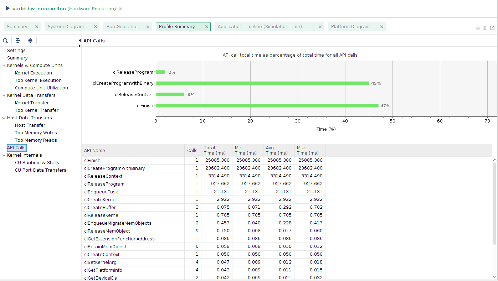
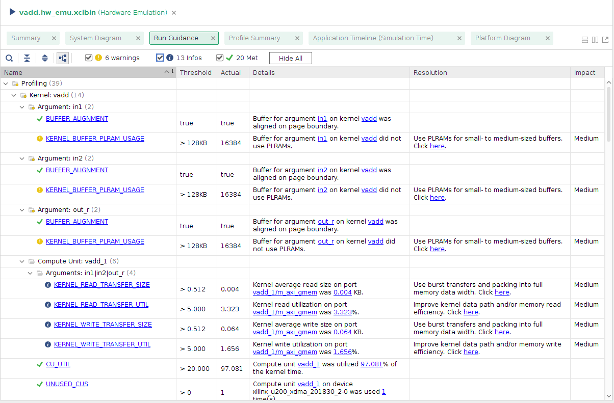

<table>
 <tr>
   <td align="center"><h1>2019.2 Vitis™ アプリケーション アクセラレーション開発フローのチュートリアル</h1><a href="https://github.com/Xilinx/SDAccel-Tutorials/branches/all">SDAccel™ 開発環境 2019.1 チュートリアルを参照</a></td>
 </tr>
 <tr>
 <td align="center"><h1>はじめてのプログラム</h1>
 </td>
 </tr>
</table>

# 4\. アプリケーションのプロファイリング

Vitis™ コア開発キットでは、コンパイル中にカーネルのリソースとパフォーマンスに関するさまざまなレポートが生成されます。また、エミュレーション モードおよび FPGA アクセラレーション カードでアプリケーション実行中のプロファイリング データも収集されます。この演習では、レポートを生成して、プロファイリング結果を収集して Vitis 統合設計環境 (IDE) 環境に表示する方法を説明します。

## プロファイル サマリ

ザイリンクス ランタイム (XRT) はホスト アプリケーションで自動的にプロファイリング データを収集します。アプリケーションが実行を終了すると、ソリューション レポートまたは作業ディレクトリ内にプロファイル サマリが HTML、CSV および Google Protocol Buffer フォーマットで保存されます。これらのレポートはウェブ ブラウザー、スプレッドシート ビューアー、または Vitis IDE の \[Profile Summary] ビューで表示できます。

1. プロファイル モニタリングを有効にするには、`profile=true` にして [プロファイルおよびトレース レポートの生成](../Pathway3/ProfileAndTraceReports.md)の「xrt.ini ファイルの作成」に従って `xrt.ini` を作成します。このファイルは、実行ディレクトリ内に含める必要があります。

   ```
   [Debug]
   profile=true
   timeline_trace=true
   data_transfer_trace=fine
   ```

2. ハードウェア エミュレーションのプロファイル サマリ レポートを生成するには、ハードウェア リンク段階で `--profile_kernel` オプションを使用してカーネルをビルドします。これにより、エミュレーション中にパフォーマンス データが収集できるようになります。このオプションは、`design.cfg` ファイルに追加できます。

   ```
   platform=xilinx_u200_xdma_201830_2
   debug=1
   profile_kernel=data:all:all:all

   [connectivity]
   nk=vadd:1:vadd_1
   ```

   ```
   v++ -t hw_emu --config design.cfg -c -k vadd -I'../src' -o'vadd.xilinx_u200_xdma_201830_2.xo' './src/vadd.cpp'
   v++ -t hw_emu --config design.cfg -l -o'vadd.xilinx_u200_xdma_201830_2.xclbin' vadd.xilinx_u200_xdma_201830_2.xo
   ```

3. プロファイル サマリを表示するには、CSV ファイルをスプレッドシート ツールで開くか、[プロファイル サマリの表示](../Pathway3/ProfileAndTraceReports.md)に示すように Vitis アナライザー使用して IDE で開きます。

   ```bash
   vitis_analyzer ./profile_summary.csv
   ```

   または

   ```
   vitis_analyzer./run_summary.csv
   ```

   

   プロファイル サマリには、どのアプリケーションにも役立つさまざまな統計が含まれます。注意するべき重要な点は、前の図でハイライトされています。このサマリには、アプリケーションの機能的なボトルネックの概要が表示されます。

4. レポートの「Kernel to Global Memory」セクションを確認してください。データ転送の数と毎転送の平均バイトがわかります。

5. 「Top Kernel Execution」セクションの \[Duration] 列を見てください。ハードウェア エミュレーション/ハードウェアでカーネルを実行するのにかかった時間を確認します。

6. 次に、プロファイル レポートの **\[OpenCL APIs]** タブをクリックします。呼び出し数および呼び出しの時間など、さまざまな OpenCL API 呼び出しに関する詳細が表示されます。

   

前の図は、データ転送にハイレベルなシミュレーション モードを使用するハードウェア エミュレーションからのものです。ほとんどのアプリケーション時間がハイライトされている呼び出し (`clProgramWithBinary`、`clEnqueueMigrateMemObjects`、および `clEnqueueTask`) で費やされていることがわかります。ハードウェアで実行する際は、上記のハイライトされている統計を確認することをお勧めします。

## アプリケーション タイムライン トレース

アプリケーション タイムラインは、ホストとデバイスのイベント情報を収集し、共通のタイムラインに表示します。これは、システムの全体的な状態とパフォーマンスを視覚的に表示して理解するのに役立ちます。これらのイベントには、次のものがあります。

* ホスト コードからの OpenCL API 呼び出し。
* AXI トランザクションの開始/停止、カーネルの開始/停止を含むデバイス トレース データ。

1. 集めたタイムライン トレース情報を有効にするには、`timeline_trace=true` および `data_transfer_trace=fine` に設定して、[プロファイルおよびトレース レポートの生成](../Pathway3/ProfileAndTraceReports.md)の「xrt.ini ファイルの作成」に示すように `xrt.ini` ファイルを作成します。

   ```
   [Debug]
   profile=true
   timeline_trace=true
   data_transfer_trace=fine
   ```

2. ハードウェア エミュレーションのタイムライン トレース レポートを生成するには、ハードウェア リンク段階で `--profile_kernel` オプションを使用してカーネルをビルドします (まだ実行していない場合のみ)。

   ```
   v++ -t hw_emu --config design.cfg -c -k vadd -I'../src' -o'vadd.xilinx_u200_xdma_201830_2.xo' './src/vadd.cpp'
   v++ -t hw_emu --config design.cfg -l -o'vadd.xilinx_u200_xdma_201830_2.xclbin' vadd.xilinx_u200_xdma_201830_2.xo
   ```

3. タイムライン トレースは、[プロファイル サマリの表示](../Pathway3/ProfileAndTraceReports.md)に示すように Vitis アナライザーを使用すると GUI で表示できます。

   ```bash
   vitis_analyzer ./timeline_trace.csv
   ```

   または

   ```bash
   vitis_analyzer ./run_summary.csv
   ```

   次の図は、生成されたタイムライン トレース レポートを示しています。

   

4. \[Timeline Trace] ビューで Read/Write データ転送を示す横棒にカーソルを置くと、バースト長、DDR メモリ リソース、転送時間などの情報がさらに表示されます。

## \[Guidance] ビュー

\[Guidance] ビューは、開発プロセス全体を通してフィードバックを提供するためのもので、実際のデザインを構築してランタイム解析までに発生した問題すべてが 1 つのページにまとめられます。

Vitis アナライザーは、特定のレポートを開くのに使用できるほか、コンパイル、リンク、実行段階で生成された compile\_summary、link\_summary、または run\_summary を直接開くこともできます。これらのサマリ レポートが開くと、Vitis アナライザーが関連するレポートを自動的に開きます。

```bash
vitis_analyzer -open ./profile_summary.csv
```

次の図は、VADD サンプルの \[Guidance] ビューを示しています。



## カーネル レポート (HLS)

Vitis コンパイラを使用してカーネルをコンパイルししたら、Vitis コンパイラが Vivado 高位合成 (HLS) ツールを実行して、OpenCL C/C++ コードを RTL コードに合成します。プロセス中、HLS ツールは自動的にレポートを生成します。レポートには、ユーザーのカーネル コードから生成されたカスタム ハードウェア ロジックのパフォーマンスおよび使用量についての詳細が含まれます。これらのレポートは、Vitis コンパイラが `--save-temps` オプションを使用して呼び出されると表示されるようになります。

```
v++ -t hw_emu --config design.cfg --save-temps -c -k vadd -I'../src' -o'vadd.xilinx_u200_xdma_201830_2.xo' './src/vadd.cpp'
```

カーネル レポートを表示するには、Vivado HLS プロジェクトを開いて、VADD の HLS 合成レポートを開きます。

```bash
vivado_hls -p _x/vadd.xilinx_u200_xdma_201830_2/vadd/vadd
```

次の図は、VADD サンプルの HLS レポートを示しています。


## 最適化

レポートおよび画像からは、アプリケーションのパフォーマンスを改善するためのスコープがわかります。別の最適化手法を使用することもできます。詳細は、このコースの次のステップである[アクセラレーションされた FPGA アプリケーションの最適化: たたみ込みの例](../convolution-tutorial/README.md)または[アクセラレーションされた FPGA アプリケーションの最適化: ブルーム フィルターの例](../bloom/README.md)チュートリアルを参照してください。

## まとめ

これで、このチュートリアルのすべての演習を終了しました。

1. 標準 C++ コードを Vitis コア開発キット カーネルに変換しました。
2. FPGA のカーネルを運用して交信するホスト プログラムをビルドしました。
3. コマンド ラインを使用してカーネルをコンパイルして xclbin にリンクしました。
4. Alveo データセンター アクセラレータ カードで実行する前に、ソフトウェアおよびハードウェア エミュレーション モードでデザインを実行しました。
5. アプリケーションのビルドおよび実行中に生成されるレポートを確認しました。</br>

<hr/>
<p align="center"><b><a href="/docs/vitis-getting-started/">入門コースの初めに戻る</a> &mdash; <a href="./README.md">チュートリアルの初めに戻る</a></b></p>
<p align="center"><sup>Copyright&copy; 2019 Xilinx</sup></p>
