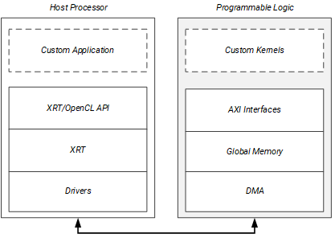

<table class="sphinxhide">
 <tr>
   <td align="center"><h1>2020.1 Vitis™ アプリケーション アクセラレーション開発フロー チュートリアル</h1><a href="https://github.com/Xilinx/Vitis-Tutorials/branches/all">2019.2 Vitis アプリケーション アクセラレーション開発フロー チュートリアル</a></td>
 </tr>
 <tr>
 <td>
 </td>
 </tr>
</table>

# FPGA アクセラレーション アプリケーションの実行モデル

## 概要

Vitis コア開発キットのアクセラレーション アプリケーションは、ソフトウェア プログラムとザイリンクス デバイス バイナリ (ハードウェア アクセラレーション カーネルを含む) の 2 つのコンポーネントで構成されます。これら 2 つのコンポーネント間の制御および通信は、ザイリンクス ランタイム (XRT) ライブラリで管理されます。

* C/C++ で記述され、OpenCL™ のような API 呼び出しを使用するソフトウェア プログラムは、x86 サーバーで実行されます。
* ハードウェア アクセラレーション カーネルは、Alveo™ データセンター アクセラレータ カード上のザイリンクス デバイスで実行されます。

XRT で管理されるソフトウェア プログラム内の API 呼び出しにより、ホストとデバイス間でデータが転送され、カーネルが実行され、最適に同期されます。ホスト x86 サーバーおよびアクセラレータ カード間の通信には、PCIe® バスまたはエンベデッド プラットフォームの AXI バスが使用されます。データは、ソフトウェア プログラムから指定したカーネルに直接送信されるか、グローバル メモリ (ソフトウェアとカーネルの両方からアクセスされる共有メモリ空間) に含められます。

次の図に、このアクセラレーション ターゲット プラットフォームの一般的な構造を示します。

右側の FPGA ハードウェア プラットフォームにはハードウェア アクセラレーション カーネル、グローバル メモリ、メモリ転送用の DMA が含まれます。カーネルには 1 つまたは複数のグローバル メモリ インターフェイスを含めることができ、プログラム可能です。

実行モデルでは、次が実行されます。

1. ホスト プログラムが、Alveo データセンター アクセラレータ カード上の PCIe インターフェイスまたはエンベデッド プラットフォームの AXI バスを介して、カーネルで必要なデータをグローバル メモリに書き込みます。
2. ホスト プログラムが、入力パラメーターを使用してカーネルを設定します。
3. ホスト プログラムが、ザイリンクス デバイスのカーネル関数の実行をトリガーします。
4. カーネルが、必要に応じてグローバル メモリからデータを読み出し、計算を実行します。
5. カーネルがグローバル メモリにデータを書き込み、ホストにタスクが終了したことを通知します。
6. ホスト プログラムは、グローバル メモリからホスト メモリにデータを転送するか、別のカーネルに処理用にデータを送信できます。

## 次の手順

コア開発キットをインストールして設定し、Vitis ツールを使用してホスト プログラムとハードウェア カーネルをビルドします。Alveo データセンター アクセラレータ カードを開発システムまたは運用システムにインストールして設定します。

[詳細...](../alveo-getting-started/README.md)  

<b><a href="../../README.md">メイン ページに戻る</a> &mdash; <a href="../../docs/vitis-getting-started/README.md">入門コースの初めに戻る</a></b>
 
Copyright&copy; 2020 Xilinx

