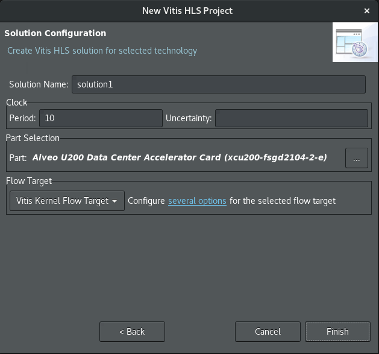
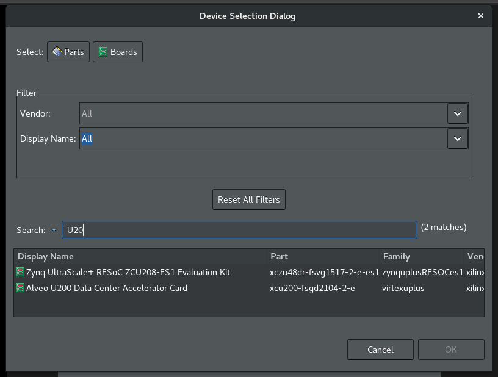

<table class="sphinxhide">
 <tr>
   <td align="center"><h1>2020.1 Vitis™ アプリケーション アクセラレーション チュートリアル</h1><a href="https://github.com/Xilinx/Vitis-Tutorials/branches/all">2019.2 Vitis アプリケーション アクセラレーション開発フロー チュートリアル</a></td>
 </tr>
 <tr>
 <td>
 </td>
 </tr>
</table>

# 1\. Vitis HLS プロジェクトの作成

Vitis HLS ツールでは、C/C++ コードを指定して Vitis コア開発キット カーネル (`.xo`) または RTL IP に合成し、ザイリンクス デバイスの PL 領域にインプリメンテーションできるようにします。新規プロジェクトを作成するには、まず合成する C/C++ ソース コードを特定します。

このチュートリアルでは、値の入力行列を処理して、固定係数を適用し、変更された値の行列を戻す単純な離散コサイン変換 (DCT) アルゴリズムを使用します。最上位 DCT 関数は、`reference_files/src` フォルダーの `dct.cpp` に含まれます。

1. 次のコマンドを入力して、Vitis HLS を GUI モードで起動します。

   `vitis_hls`

   Vitis HLS が開きます。

2. **\[File]** → **\[New Project]** をクリックします。

   New Vitis HLS Project ウィザードが表示されます。

   

3. Vitis HLS プロジェクト タイプを作成します。

   1. \[Project name] フィールドに `dct_prj` と入力します。
   2. \[Location] フィールドで **\[Browse]** をクリックし、プロジェクトのディレクトリを選択します。
   3. **\[Next>]** をクリックします。

   New Vitis HLS Project ウィザードの \[Add/Remove Files] ページが表示されます。

   

4. 次のように選択します。

   1. **\[Add Files]** をクリックしてプロジェクトのソースを指定します。

      1. **./reference-files/src** フォルダー ディレクトリに移動して、**dct.cpp** を選択します。

   2. New Vitis HLS Project ウィザードで \[Top Function] フィールドの **\[Browse]** ボタンをクリックし、\[Select Top Function] ダイアログ ボックスを開きます。

      1. **dct (dct.cpp)** 関数を選択して **\[OK]** をクリックします。

         ![[Select Top Function] ダイアログ ボックス](./images/create_project-select_top_function.png)

   3. **\[Next>]** をクリックします。

      New Vitis HLS Project ウィザードの \[Add/Remove Testbench Files] ページが表示されます。

      適切なテストベンチを記述すると、C 関数を RTL シミュレーションよりも短時間で実行できるので、生産性が上がります。C を使用してアルゴリズムを開発して合成前に検証する方が、RTL コードを開発してデバッグするよりもはるかに高速です。詳細は、Vitis 統合ソフトウェア プラットフォームの資料 (UG1416) の Vitis HLS フローの[テストベンチの記述](https://japan.xilinx.com/html_docs/xilinx2020_1/vitis_doc/verifyingcodecsimulation.html#sav1584759936384)を参照してください。

      

5. **\[Add Files]** をクリックしてテストベンチおよびプロジェクトの追加ファイルを指定します。

   1. `./reference-files/src` フォルダーの **dct\_test.cpp**、**in.dat**、および **out.golden.dat** を選択します。

      * `dct_test.cpp` はカーネルを介して複数回繰り返すデザインのテストベンチです。
      * `in.dat` には、カーネルで処理される入力値が含まれます。
      * `out.golden.dat` には、dct 関数の出力との比較に使用する既知の出力結果が含まれます。

   2. **\[Next>]** をクリックします。

      New Vitis HLS Project ウィザードの \[Solution Configuration] ページが表示されます。

      このページでは、ビルドに使用する特定のビルド コンフィギュレーションであるソリューションを作成および定義します。ソリューションには、クロック周波数の定義およびクロックのばらつきが含まれ、ビルドするプラットフォームとザイリンクス デバイスが指定されます。ソリューションは、RTL コードを構築し、異なるソリューションで異なる指示子を使用してさまざまな最適化をテストするためのフレームワークを提供します。

      

6. 次のように選択します。

   1. **\[Solution Name]** を指定するか、デフォルトの名前をそのまま使用します。

   2. **\[Period]** でクロックの周期をデフォルトの 10 ns に指定します。

   3. クロックのばらつきはデフォルトの 12% にするか、空白にしておきます。詳細は、『Vitis 統合ソフトウェア プラットフォームの資料』 (UG1416) の Vitis HLS フローの[クロック周波数の指定](https://japan.xilinx.com/cgi-bin/docs/rdoc?v=2020.1;t=vitis+doc;d=creatingnewvitishlsproject.html;a=ycw1585572210561)を参照してください。

   4. **\[...]** をクリックしてプロジェクトのパーツを定義します。

      \[Device Selection Dialog] ダイアログ ボックスが開きます。  

      \[Device Selection] ダイアログ ボックスでは、ザイリンクス デバイスを指定したり、1 つまたは複数のザイリンクス デバイスを含むボードを選択したりできます。

7. 次のように選択します。

   1. ダイアログ ボックス上部の **[Boards]** をクリックします。

   2. \[Search] フィールドに `U200` と入力します。テキストを入力していくにつれ、選択肢が狭まっていきます。

      1. **\[Alveo U200 Data Center Accelerator Card]** をクリックします。
      2. **\[OK]** をクリックします。

      \[Solution Configuration] ページに戻ります。

8. \[Solution Configuration] ページでドロップダウン リストから **\[Vitis Kernel Flow]** をクリックします。

   これにより、プロジェクトの出力として Vitis アプリケーション アクセラレーション ハードウェア カーネル (.xo) を作成できるようになります。Vitis カーネル フローをイネーブルにした場合のデフォルト動作については、『Vitis 統合ソフトウェア プラットフォームの資料』 (UG1416) の Vitis HLS フローの [Vitis カーネル フローのイネーブル](https://japan.xilinx.com/html_docs/xilinx2020_1/vitis_doc/creatingnewvitishlsproject.html#uiy1584905571731)を参照してください。

9. プロジェクト設定が終了したので、**\[Finish]** をクリックします。Vitis HLS で新規プロジェクトがデフォルト表示で開きます。

   

## まとめ

DCT プロジェクトを作成し、ザイリンクス デバイスまたはボードをターゲットに指定し、ソリューション特性を設定しました。次の演習[高位合成の実行と結果の解析](./synth_and_analysis.md)に進んでください。 

<b><a href="../../README.md">メイン ページに戻る</a> &mdash; <a href="./README.md">チュートリアルの初めに戻る</a></b>

Copyright&copy; 2020 Xilinx

