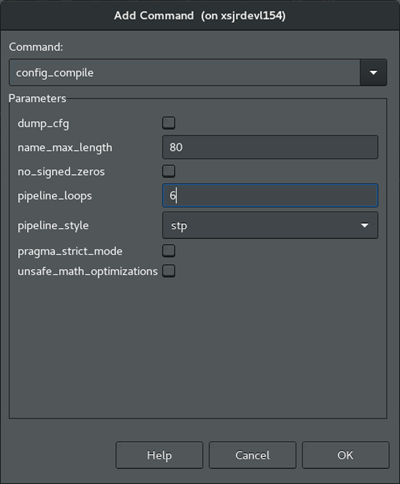
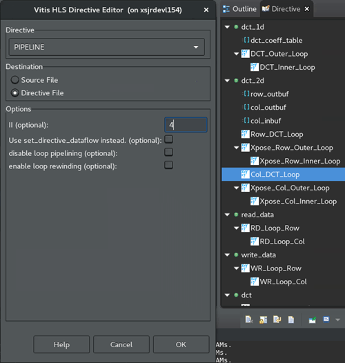
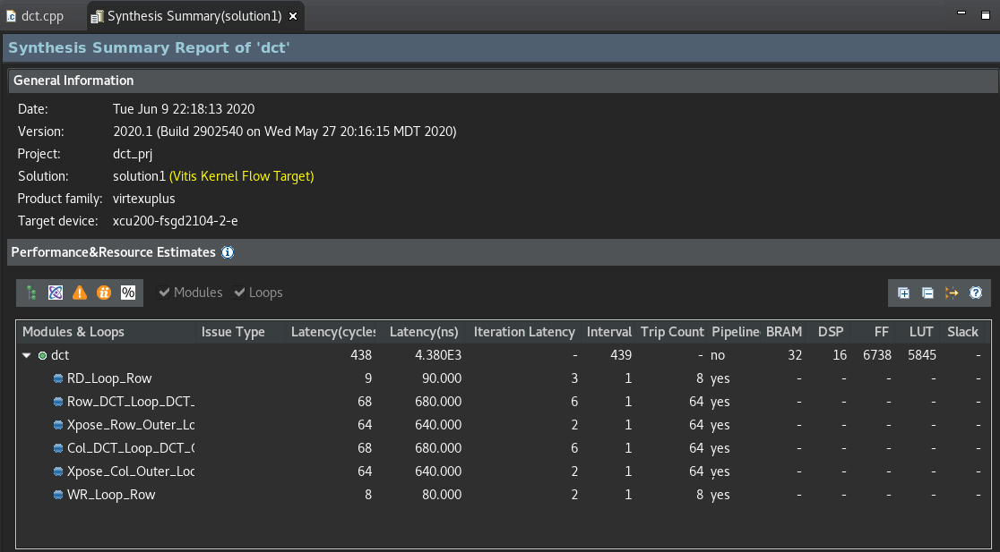

<table class="sphinxhide">
 <tr>
   <td align="center"><h1>2020.1 Vitis™ アプリケーション アクセラレーション チュートリアル</h1><a href="https://github.com/Xilinx/Vitis-Tutorials/branches/all">2019.2 Vitis アプリケーション アクセラレーション開発フロー チュートリアル</a></td>
 </tr>
 <tr>
 <td>
 </td>
 </tr>
</table>

# 3\. 最適化テクニックの使用

この演習では、[高位合成の実行および結果の解析](./synth_and_analysis.md)演習からの II 違反を解決するさまざまな最適化テクニックについて説明します。

## パイプライン ループのしきい値の設定

> **重要**: デザイン内で小さなループをパイプライン処理しようとすると違反がレポートされます。ループの自動パイプラインをオフにすると、違反はレポートされなくなります。

合成サマリレポートを確認すると、反復 (トリップカウント) が 64 および 8 のループで II 違反があるのがわかります。**config\_compile** を `6` に設定すると、最適化からこれらのループが除外されます。

1. \[Explorer] ビューでプロジェクト ソリューションまたは `solution1` を右クリックして **\[Solution Settings]** をクリックします。\[Solution Settings] ダイアログ ボックスが開きます。

2. **\[General]** 設定を選択し、**\[Add]** をクリックして新しい設定を追加します。

3. \[Add Command] ダイアログ ボックスで、次のオプションを設定します。

   1. \[Command] で **config\_compile** を選択します。

   2. [pipeline\_loops] に `6` を入力します。ループの反復が 6 回以下の場合にのみパイプライン処理が自動的に実行されます。

      

4. **\[OK]** をクリックします。\[Solution Settings] ダイアログ ボックスに戻ります。

5. **\[OK]** をクリックして `config_compile` コマンドを追加し、ループの自動パイプライン処理の設定を変更します。

6. ツールバーから **\[C Synthesis]** をクリックして合成コマンドを再実行し、結果を表示します。

   この設定により、II 違反が 4 サイクルから 2 サイクルに削減されましたが、問題が完全に解決されたわけではありません。

   この設定は、ループがデザインのクリティカル パスにない場合や、必ず解決する必要のある大きな問題でない場合などには無難な方法かもしれません。すべての違反を必ずしも解決する必要はなく、解決するのが不可能な場合もあります。これらは、パフォーマンスのアーチファクトにすぎません。

   

   > **ヒント**: 先に進む前に変更を元に戻しておきます。ソリューションを右クリックし、**\[Solution Settings]** をクリックして、先ほど追加した config\_compile コマンドを削除します。

## パイプライン レイテンシの設定

別の最適化ソリューションとして、4 または 2 クロック サイクルのレイテンシが許容範囲のパフォーマンスであることをツールで指定する方法があります。これにより、レイテンシがユーザーの指定と同じになるので、警告が表示されなくなります。アプリケーションの全体的なレイテンシは、これらのループが II=4 であっても、たいした問題ではないことを示しています。

前のセクションで、**config\_compile** コマンドがデザイン全体のコンパイルに影響するツール設定コマンドであることがわかりました。この最適化は、ツール自体ではなく、ソース コードの特定の部分に適用するコード指示子です。

1. 関数をソース コード エディターで開きます。

   プロジェクトの `Source` フォルダーを展開し、`dct.cpp` ファイルをダブルクリックして \[Explore] ビューを開きます。

   ソース コード エディターが開くと、IDE の右側にコードの \[Outline] ビューと \[Directive] ビューも表示されます。

   * **\[Outline] ビュー**: 開いたソース コード ファイルのアウトラインが表示され、コードをすばやく確認できます。
   * **\[Directives] ビュー**: コードの演算または要素を選択して `HLS pragmas` をソース コードに割り当てたり、アクティブ ソリューションに関連付けられた Tcl スクリプトに `set_directive` コマンド割り当てたりできます。詳細は、『Vitis 統合ソフトウェア プラットフォームの資料』 (UG1416) の Vitis HLS フローの[プラグマおよび指示子の追加](ttps://japan.xilinx.com/cgi-bin/docs/rdoc?v=2020.1;t=vitis+doc;d=optimizinghlsproject.html;a=gip1583519972576)を参照してください。

2. \[Directive] ビューの `dct_2d` 関数の階層で **\[Col\_DCT\_Loop]** を右クリックし、**\[Insert Directive]** をクリックします。

   \[Vitis HLS Directive Editor] が表示されます。

   

3. \[Directive] で **\[Pipeline]** 指示子を選択します。

4. \[Destination] で **\[Directive File]** を選択します。これがデフォルトです。

   指示子を使用すると、異なるソリューションを異なる指示子ファイルで作成し、さまざまな方法でパフォーマンスを最適化して、最適なソリューションを見つけることができます。HLS プラグマを直接ソース ファイルに追加すると、すべてのソリューションに同じ最適化が使用されます。

   デザイン プロセスの後期では、安定した最適化を指示子ファイルから C/C++ コードの HLS プラグマに変更して、最適化がコードに含まれるようにすることをお勧めします。これは、この後の演習で実行します。

5. \[II (optional)] に `4` を入力します。これにより、現在のパフォーマンスが許容され、II 違反がなくなります。

6. **\[OK]** をクリックして指示子を適用します。\[Directive] ビューに HLS PIPELINE II=4 が追加されました。

7. **\[C Synthesis]** をクリックして合成を再実行します。

   指定した演算の II 違反はレポートされなくなります。\[Interval] 列は 4 のままであることに注意してください。これは、問題としてレポートされなくなりました。

   

> **ヒント**: 先に進む前に変更を元に戻しておきます。ソース コードのタブをクリックしてアクティブにし、\[Directive] ビューを表示します。**HLS PIPELINE II=4** を右クリックし、**\[Remove Directive]** をクリックします。合成を再実行します。

## BIND\_STORAGE を使用したデュアル ポート RAM の割り当て

\[DRCs] ビューの DRC 警告メッセージを確認します。「`Unable to schedule load operation...`」というメッセージは、メモリ トランザクションに関して load/load (または read/read 競合) 問題があることを示しています。ここでは、レイテンシを許容する代わりに、インプリメンテーションを最適化して最適なパフォーマンス (II=1) を達成することを試みます。

メモリの読み出しまたは書き込みに関する問題は、読み出しまたは書き込みに使用するメモリ ポートを増やすことで解決できることがあります。BIND_STORAGE プラグマまたは指示子を使用して、ストレージのインプリメントに使用するデバイス リソースのタイプを指定するのが、1 つの方法です。BIND\_STORAGE は、RTL で変数に関連付けられたストレージ構造のインプリメントに使用する特定のデバイス リソースを定義します。詳細は、『Vitis 統合ソフトウェア プラットフォームの資料』 (UG1416) の Vitis HLS フローの [BIND\_STORAGE](https://japan.xilinx.com/html_docs/xilinx2020_1/vitis_doc/vcb1584808314102.html) を参照してください。

1. **dct.cpp** タブをクリックしてコード エディターをアクティブにします。

2. \[Directive] ビューで `dct_2d` 関数の `col_inbuf` 変数を右クリックし、**\[Add Directive]** をクリックします。

   \[Vitis HLS Directive Editor] が表示されます。

3. \[Directive] で **\[BIND\_STORAGE]** を選択します。

4. \[Destination] で **\[Directive File]** を選択します。

5. **\[Options]** には、選択した変数がリストされます。変数に使用するメモリのタイプをデュアル ポート RAM (`ram_2p`) に指定します。

   オプションでインプリメンテーションおよびレイテンシも指定できます。ここでは、空白のままにしておきます。

6. **\[OK]** をクリックします。

7. 最上位 `dct` 関数の `buf_2d_out` 変数に対しても同じ処理を繰り返します。

   1. \[Directive] ビューで `buf_2d_out` 変数を選択し、**BIND\_STORAGE** プラグマを追加してデュアル ポート RAM (`ram_2p`) を指定します。

8. **\[Run C Synthesis]** をクリックして合成を再実行して、結果を確認します。

   II 違反は解決できなかったことがわかります。II=1 を達成するには 2 つよりも多くのポートが必要なようです。

> **ヒント**: 先に進む前に変更を元に戻しておきます。ソース コードのタブをクリックしてアクティブにし、\[Directive] ビューを表示します。**HLS BIND\_STORAGE** プラグマを右クリックし、**\[Remove Directive]** をクリックします。必要であれば、合成を再実行します。

## 配列パーティションの割り当て

パイプライン処理されたループ反復のメモリ ポートの競合を回避するには、ARRAY_PARTITION 指示子を使用して配列の構造を再設定する方法もあります。

ARRAY\_PARTITION では、1 つの大きな配列を使用する代わりに、配列をより小さな配列に分割したり、個別のレジスタに分割したりできます。これにより、実質的にストレージの読み出しおよび書き込みポートを増加でき、メモリを完全に削除できることもあるので、デザインのスループットを改善できる可能性があります。ただし、ARRAY_PARTITION にはより多くのメモリ インスタンスまたはレジスタが必要となるので、エリアおよびリソース使用量が増加します。詳細は、『Vitis 統合ソフトウェア プラットフォームの資料』 (UG1416) の Vitis HLS フローの [ARRAY\_PARTITION](https://japan.xilinx.com/html_docs/xilinx2020_1/vitis_doc/xoa1585343027355.html) を参照してください。大きな配列を分割する場合、コンパイル時間が長くなることもあります。

1. \[Directives] ビューで関連する II 違反から配列変数 **col\_inbuf** および **buf\_2d\_out** を選択します。

2. 右クリックして **\[Add Directive]** をクリックします。

   次の図に示す \[Vitis HLS Directive Editor] が開きます。

   

3. \[Vitis HLS Directive Editor] で次のようにオプションを指定します。

   1. \[Directive] で **\[ARRAY\_PARTITION]** を選択します。
   2. \[Destination] で **\[Directive File]** を選択します。
   3. \[Options] には、選択した変数がリストされます。\[dimension] はデフォルト値の 1 に設定します。
   4. \[factor] を **8** に指定します。
   5. \[type] で **\[cyclic]** を選択します。

4. **\[OK]** をクリックして閉じて、指示子を適用します。

5. `buf_2d_out` 変数に対しても上記の手順を繰り返します。

6. **\[C Synthesis]** をクリックして合成を再実行して結果を確認します。

   結果から、ループ パイプラインおよびパフォーマンスの改善を維持しながら、この最適化で II 違反を解決できたことがわかります。

7. 合成サマリ レポートで、合成したデザインの詳細を確認します。

   

   係数 8 で cyclic パーティションを選択した理由は、そのコード構造に関係しています。ループは 8x8 行列 (外側ループに 8、内側ループに 8 必要) を処理します。係数 8 のサイクリック配列分割を選択すると、8 つの配列が作成され、それぞれが反復ごとに 1 回読み出されます。これにより、ループのパイプライン中にメモリ アクセスが競合しなくなります。

## 次の手順

デザインの特定の問題を最適化で解決したので、もう 1 つの最適化方法について学びます。次は、[DATAFLOW 最適化を使用](./dataflow_design.md)します。 

<b><a href="../../README.md">メイン ページに戻る</a> &mdash; <a href="./README.md">チュートリアルの初めに戻る</a></b>

Copyright&copy; 2020 Xilinx

