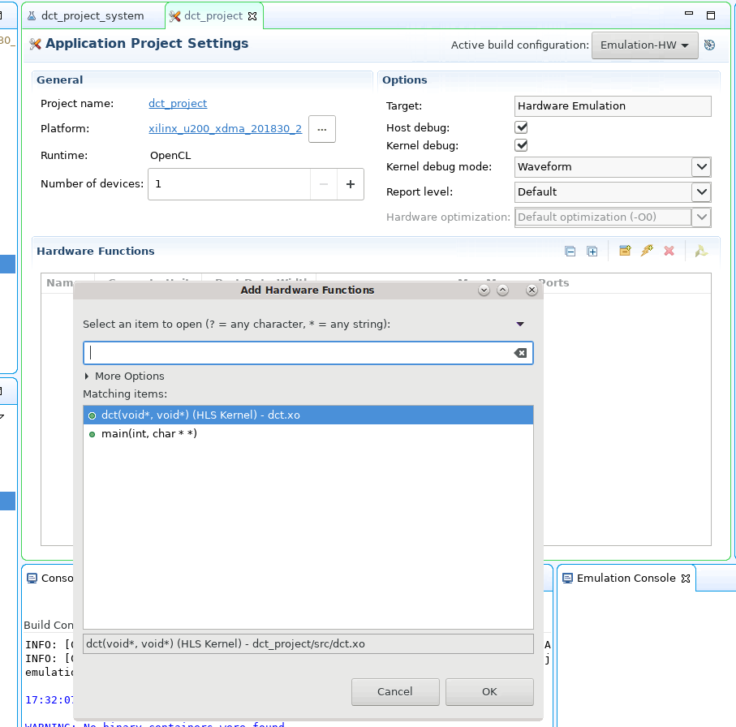

<table class="sphinxhide">
 <tr>
   <td align="center"><h1>2020.1 Vitis™ アプリケーション アクセラレーション チュートリアル</h1><a href="https://github.com/Xilinx/Vitis-Tutorials/branches/all">2019.2 Vitis アプリケーション アクセラレーション開発フロー チュートリアル</a></td>
 </tr>
 <tr>
 <td>
 </td>
 </tr>
</table>

# 5\. Vitis ツールでの HLS カーネルの使用

このチュートリアルの前半では、HLS カーネル コードを最適化して Vitis のコンパイルしたオブジェクト ファイル (`.xo`) を生成しました。また、最適化指示子を Tcl 指示子ファイルから `dct.cpp` ファイルに含まれるプラグマに移行しました。指示子は、Vitis HLS ツールを使用する場合はさまざまなソリューションを試してデザイン問題を解決できるので効果的ですが、Vitis アプリケーション アクセラレーション開発フローで使用する場合は、ソース コードにプラグマを含めることをお勧めします。

この演習では、Vitis IDE で新しいアプリケーション プロジェクトを作成し、ホスト アプリケーション コードとコンパイルした HLS カーネルをプロジェクトに追加し、アプリケーションをビルドして実行します。

> **ヒント:** Vitis IDE で `dct.cpp` ソース ファイルを使用すると、ソース コードをコンパイルし直して Vitis カーネル (`.xo`) ファイルを作成できます。

## Vitis IDE でのアプリケーション プロジェクトの作成

1. 次のコマンドを入力して、Vitis IDE を起動します。

   `vitis`

   \[Eclipse Launcher] ダイアログ ボックスでワークスペースを選択します。

2. 新規または既存のワークスペースを指定します。**\[Launch]** をクリックします。

3. **\[File]** → **\[New Application Project]** をクリックします。

   New Application Project ウィザードが表示されます。**\[Next]** をクリックします。

4. \[Platform] ページで `xilinx_u200_xdma_201830_2` を選択します。**\[Next]** をクリックします。

5. \[Application Project Details] ページでアプリケーション プロジェクト名に `dct_project` と指定し、**\[Next]** をクリックします。

6. \[Templates] ページで **\[Empty Application]** を選択して **\[Finish]** をクリックし、アプリケーション プロジェクトが作成されます。

Vitis IDE で `dct_project` が作成され、\[Design] パースペクティブが開きます。

### ソース ファイルの追加

1. \[Project Explorer] ビューで `src` フォルダーを右クリックして **\[Import Sources]** をクリックします。

   \[Import Sources] ダイアログ ボックスが開きます。ホスト アプリケーション、`#include` ファイル、およびプロジェクトの Vitis HLS カーネル (`dct.xo`) を指定する必要があります。

2. **\[Into folder]** フィールドで `dct_project/src` フォルダーが指定されていることを確認します。これで、ソース ファイルが正しいディレクトリにインポートされます。

3. \[From] ディレクトリで **\[Browse]** ボタンをクリックし、\[Import from directory] ダイアログ ボックスを表示します。`reference_files/src` フォルダーを指定して **\[OK]** をクリックします。

4. `src` フォルダーの次のファイルを選択します。

   - `dct_top`.cpp: ホスト アプリケーション。
   - `dct_top.h` および `dct.h`: ホスト アプリケーションに必要なインクルード ファイル。

5. **\[Finish]** クリックしてファイルをプロジェクトに追加します。

6. `src` フォルダーを右クリックし、**\[Import sources]** をクリックします。

7. **\[Browse]** ボタンをクリックし、`./vitis_hls_analysis/reference-files` フォルダーまで移動したら **\[OK]** をクリックします。

8. 前の演習で Vitis HLS からエクスポートした `dct.xo` ファイルを選択し、**\[Finish]** をクリックしてプロジェクトにインポートします。

   これで、ホスト アプリケーション (`dct_top.cpp`) と Vitis HLS カーネル (`dct.xo`) がプロジェクトに含まれるようになりました。

9. `dct_top.cpp` ファイルをダブルクリックしてコード エディターで開き、コードを確認します。

   このコードの構造は、前半の演習で C および C/RTL 協調シミュレーションを実行した際に使用したテストベンチと類似しています。ここでは、ホスト アプリケーションにアプリケーションのザイリンクス ランタイム (XRT) ライブラリを設定および管理する OpenCL API が追加されています。

   ホスト アプリケーションの記述に関する詳細は、『Vitis 統合ソフトウェア プラットフォームの資料』 (UG1416) のアプリケーション アクセラレーション開発フローの[ホスト アプリケーション](https://japan.xilinx.com/html_docs/xilinx2020_1/vitis_doc/devhostapp.html#vpy1519742402284)を参照してください。サンプル アプリケーションを[ホスト コードの最適化](../host-code-opt/README.md)チュートリアルで試すこともできます。

   ホスト アプリケーションを確認したら、アプリケーション プロジェクトを作成したときに選択した Alveo データセンター U200 アクセラレータ カードで実行するハードウェア関数を指定する必要があります。

10. \[Project Settings] ビューの \[Hardware Functions] セクションで **\[Add Hardware Functions]** をクリックします。

    \[Add Hardware Functions] ダイアログ ボックスが開き、`dct.xo` に含まれる `dct()` 関数とホスト アプリケーションに含まれる `main()` 関数がリストされます。

11. 次の図に示すように `dct()` 関数を選択して **\[OK]** をクリックします。

    

12. \[Project Settings] ビューで **\[Kernel debug]** チェック ボックスをオフにします。

> **ヒント:** オフにしない場合、プロジェクトをビルドする際にメッセージが表示されます。

## ハードウェア エミュレーション ターゲットのビルドおよび実行

ソース コードをプロジェクトにインポートしてハードウェア関数を指定したら、アプリケーション プロジェクトをビルドする準備は完了です。ビルド ターゲットには複数の選択肢があります。詳細は、『Vitis 統合ソフトウェア プラットフォームの資料』 (UG1416) のアプリケーション アクセラレーション開発フローの[ビルド ターゲット](https://japan.xilinx.com/html_docs/xilinx2020_1/vitis_doc/buildtargets1.html#rst1525720251890)、または[アクセラレーション アプリケーションのビルドおよび実行の基本概念](../Pathway3)チュートリアルを参照してください。

1. \[Assistant] ビューで `dct_project` を展開すると、\[Emulation-SW]、\[Emulation-HW]、\[Hardware] ビルド ターゲットが表示されます。

2. **\[Emulation-HW]** を右クリックし **\[Set Active]** をクリックし、アクティブ ターゲットにします。

3. **\[Emulation-HW]** ターゲットをもう一度右クリックし、**\[Build]** をクリックします。

   Vitis IDE により、アプリケーション プロジェクトがハードウェア エミュレーション用にビルドされます。これには、ハードウェアのビルドほど時間はかかりません。ビルドが終了したら、\[Console] ビューでプロセスの実行中に表示されたメッセージを確認します。

4. \[Assistant] ビューで **\[Emulation-HW]** ターゲットを右クリックして **\[Run]** → **\[Run Configurations]** をクリックします。\[Run Configurations] ダイアログ ボックスが開きます。

5. **\[Arguments]** タブをクリックし、**\[Automatically add binary containers to arguments]** チェック ボックスをオンにして **\[Apply]** をクリックします。

6. **\[Run]** をクリックしてアプリケーションを実行します。

   

**\[Run]** をクリックすると、指定した `.xclbin` ファイル (`dct.xo` から作成) と U200 プラットフォームが読み込まれて、ホスト アプリケーションが実行されます。[Console] ビューではアプリケーションの実行中に表示されたメッセージを確認でき、[Emulation Console] ビューではエミュレーション環境の結果を確認できます。アプリケーションがエラーなく実行されると、[Console] ビューに 「**Test Passed**」と表示されます。

## まとめ

このチュートリアルでは、次のことを学びました。

1. Vitis HLS ツールで C/C++ コードを最適化し、Vitis アプリケーション アクセラレーション開発フローで使用できるように RTL コードに合成しました。
2. コードを最適化した後、Vitis アプリケーション プロジェクトで使用できるよう、コンパイル済みカーネル オブジェクト (`.xo`) をエクスポートしました。
3. Vitis IDE で新しいアプリケーション プロジェクトを作成し、ホスト ソース コードと HLS カーネル オブジェクトをインポートし、ハードウェア エミュレーション ターゲットをビルドおよび実行しました。

これらは、Vitis および Vitis HLS ツールを使用してアプリケーションおよび関数をビルドしてアクセラレーションする要素です。Vitis アプリケーション プロジェクトでは、RTL カーネル オブジェクト (`.xo`) を含む Vitis HLS カーネルとコンパイルされていない C/C++ カーネル コード (`.c`/`.cpp`) を混合して、より複雑なアクセラレーション アプリケーションを作成できます。

このチュートリアルでは、前の演習で最適化したコンパイルされていない C++ コード (`dct.cpp`) を作成しました。必要に応じて HLS カーネル オブジェクトを削除し、Vitis アプリケーション プロジェクトにこの最適化済み C++ コードを追加できます。その場合、Vitis IDE で C++ カーネル コードをコンパイルする際に、ビルド プロセスの一部として Vitis HLS が呼び出されます。

 

<b><a href="../../docs/vitis-getting-started/README.md">入門コースの初めに戻る</a> &mdash; <a href="./README.md">チュートリアルの初めに戻る</a></b>

Copyright&copy; 2020 Xilinx

